# Development and Freeze of a Point-in-Time Multi-Horizon ETF Rotation Strategy for a UK SIPP

## Evidence from a Causal Industry-and-Theme ETF Universe, 2017–2026

**Project EDGE / UKACTIVE research programme**  
**Paper version:** 1.0  
**Generation date:** 2026-08-27  
**Historical cutoff:** 2026-08-21  
**Frozen model identifier:** `INDUSTRY_PLUS_THEME | M2_BASE | TOP7 | MONTHLY | CASH0_ALWAYS_INVESTED | EQUAL`  
**Evidence classification:** `E2_DEVELOPMENTAL`  
**Repository source commit:** `df30c9be430c4a746a6e3ec0d97690612badd4fa`  
**Freeze commit:** `a8008f7709af3000a889bb234a86f8c520c4ed73`  
**Results commit:** `beb8d49828b9819aa167d2e07ffdc2b92581b36b`

> **Non-deployment statement.** This paper documents a frozen developmental research model and a conditional pilot design. It is not an investment recommendation, does not create broker orders, and does not establish operational readiness. At the final A5C decision the exact status was `AWAITING_CURRENT_HOLDINGS_INPUT`, with `pilot_operationally_ready=false`.

## Abstract

This paper documents the development and freeze of UKACTIVE, a long-only exchange-traded-fund rotation model intended for possible use as a limited active sleeve in a United Kingdom self-invested personal pension. The investigation asked whether benchmark-relative price history could rank economically distinct industry and thematic ETF exposure families in a causal, implementable way; whether any ranking information could survive realistic costs; and whether cash, trend or regime controls could improve the result. The historical evidence ends on 2026-08-21. A reconstructed London Stock Exchange session calendar, launch-aware eligibility, non-filled missing data, economic-family mappings and next-session execution rules produced a common executable comparison window from 2017-03-01 to 2026-08-21.

The frozen signal, M2, combines cross-sectional percentiles of benchmark-relative total returns over 21, 42, 63, 126 and 252 sessions with weights 0.10, 0.15, 0.25, 0.30 and 0.20. It selects seven eligible families monthly, weights them equally and remains invested. Historical results are net of 20 basis points one-way friction and fixed dealing charges. On the common window, standalone M2 compounded at 13.14% per year, versus 11.60% for global developed equities and 11.53% for the contemporaneous equal-weight opportunity pool; its maximum drawdown was −23.53%, Ulcer Index 8.20%, annualised volatility 18.49% and longest underwater period 857 days. Over the latest five years, M2 compounded at 13.62%, 2.10 percentage points above global developed equities. These point estimates are economically interesting but uncertain: six-month block-bootstrap intervals for annualised excess included zero.

Matched random selection and rank shuffling placed the historical candidate above the 99th percentile for diagnostic CAGR, indicating meaningful ranking information relative to random choice. Adverse evidence is equally important. No broad false-discovery-adjusted signal result survived; pre-2020 and ex-2025 comparisons reversed; deleting the three largest holding spells reversed the incremental result; daily and weekly implementations were cost-fragile; CASH1 failed on full history despite favourable recent results; and no dynamic defensive or regime policy passed. M2 was therefore frozen to stop further exposed-history optimisation and proposed only as a 10% whole-SIPP pilot sleeve within a 65% global-core / 25% defensive wrapper, subject to operational readiness and explicit approval. It is not classified as independently confirmed alpha. Prospective evidence is required.

**Keywords:** ETF rotation; industry momentum; thematic investing; cross-sectional momentum; point-in-time data; UK SIPP; transaction costs; drawdown; right-tail returns; backtest overfitting.

## Evidence and citation convention

Internal citations use an evidence-matrix identifier followed by stage, exact artefact, commit and row or field. For example, “Internal source [BR-7]: A4D, `UKACTIVE_A4D_BREADTH_RESULTS.csv`, commit `f411e0d169640a5120decee6940dc8a5769c3b5e`, `TOP7`, full-history and latest-five-year rows.” The complete mapping, including sample and metric definition, is in `UKACTIVE_PAPER_SOURCE_EVIDENCE_MATRIX.csv`. Where a machine-readable decision or scorecard exists it takes precedence over a narrative report. External literature uses citation keys from `UKACTIVE_ETF_ROTATION_REFERENCES.bib`.

## 1. Introduction

UKACTIVE began with a practical retirement-portfolio question rather than with a preferred signal. A UK self-invested personal pension (SIPP) can hold a broad global equity core cheaply, but a static global index cannot deliberately tilt toward industries or themes experiencing persistent relative leadership. Exchange-traded funds make such exposures accessible in discrete, auditable holdings. They also introduce complications: many funds are young; one economic exposure can have several listings or share classes; current broker availability says little about historical availability; London trading dates differ from vendor calendars; apparently small turnover differences can dominate a retail-scale signal; and thematic returns may be concentrated in a few exceptional trends.

The research objective was consequently dual. The first objective was to test whether historical relative strength contains causal cross-sectional ranking information among investable economic exposures. The second was to determine whether that information can become a defensible pension implementation after costs and path risk. These are different propositions. A signal can rank future returns better than chance yet be too concentrated, intermittent or costly to deserve a large allocation. Conversely, a static reduction in equity exposure can reduce drawdown without demonstrating any timing ability.

Cash was admitted from the outset as a genuine alternative because a long-only pension design need not remain fully exposed when evidence supports defence. Daily, weekly and monthly reviews were also initially allowed: higher frequency can react sooner, while lower frequency can suppress noise and cost. The research did not assume which trade-off would prevail. It tested frequency only after narrowing the signal and breadth questions, then evaluated cash rules, weighting, exits, matched-exposure controls and causal regimes.

The practical focus ultimately shifted from an all-or-nothing active portfolio to a bounded sleeve. That shift did not redefine the scientific object. Three objects must remain separate throughout:

1. **Scientific active strategy:** `M2_BASE | TOP7 | MONTHLY | CASH0_ALWAYS_INVESTED | EQUAL`, a 100% standalone diagnostic portfolio used to study the ranking process.
2. **Initial whole-SIPP pilot wrapper:** 65% SWDA/global developed equity core, 10% frozen M2 rotation and 25% strategic/tactical defensive assets. This is a risk budget, not part of M2.
3. **Capital-continuity control:** 75% SWDA, 25% defensive assets and 0% M2. This is the static fallback and contains no active edge claim.

The paper’s contribution is narrow: it gives a self-contained, traceable account of how one causal ETF-family ranking model was constructed, subjected to adverse tests, selected from preregistered developmental alternatives, frozen, and bounded for prospective observation. It does not claim that momentum is generally profitable, that the M2 mechanism is proven, or that the historical result will persist. Published evidence supplies an external prior and mechanism context; it is not UKACTIVE evidence.

## 2. Research aims and questions

The programme’s original question—whether relative momentum could identify attractive ETF exposures—evolved as data defects and implementation constraints became visible. The final questions and dispositions were:

1. **Does benchmark-relative, multi-horizon ETF momentum contain causal cross-sectional ranking information?** Developmental answer: yes relative to matched random choice and in several IC/top-tail diagnostics, but not as a broad false-discovery-adjusted statistical result.
2. **Is the ranking economically monetisable after realistic costs?** Developmental answer: historically yes for the frozen monthly TOP7 portfolio at baseline costs; the margin materially weakens at doubled costs.
3. **What breadth captures the effect without excessive concentration or dilution?** Answer: a TOP6–TOP9 region, with TOP7 selected as its representative rather than its maximum-return cell.
4. **Which rebalance frequency provides the best after-cost balance?** Answer: monthly. Daily was dominated by friction and noise; weekly remained plausible but fragile.
5. **Can cash or regime rules reduce drawdown without destroying compounded return?** Answer: none of the tested rules passed. Reduced exposure sometimes lowered MDD, but timing value was not established.
6. **Is the result persistent or driven by a small number of years, themes or holding spells?** Answer: materially episodic and right-tail dependent. Single-family removal did not reverse the full result, but joint removal of leading contributors and exclusion of 2025 did.
7. **Does the strategy beat random selection from the same opportunity set?** Answer: yes in the completed matched-count and rank-shuffle falsifications, at above the 99th diagnostic CAGR percentile.
8. **Does a limited M2 sleeve add value to a global-equity core?** Historical answer: a 10% sleeve added a small after-cost CAGR increment to the static 75/25 control, concentrated in leadership years; prospective usefulness remains unconfirmed.
9. **What is the most defensible frozen implementation for a UK SIPP?** Answer: the exact M2 monthly TOP7 equal-weight signal, used only within the 65/10/25 wrapper after operational readiness and explicit approval.

Several questions remain unresolved: the out-of-sample persistence of the ranking; actual execution shortfall; whether the right-tail process recurs across independent leadership episodes; whether current implementation lines remain continuously available; and whether 15% or 25% whole-SIPP allocations would be justified. No untouched historical holdout or independent E3 confirmation exists.

## 3. Research lineage and decision chronology

The lineage is a sequence of corrections and falsifications, not a single backtest. Table 1 condenses the complete path. Stage labels group closely related remediations where their scientific function was the same; the supplement provides individual manifests and hashes.

**Table 1. Research lineage and stage decisions**

| Stage | Objective and new capability | Principal test or defect | Decision | Consequence |
|---|---|---|---|---|
| A0/A1 | Discover LSE listings; map share classes and economic families | Current-universe census and taxonomy | Data foundation only | Build historical total-return and cash panels |
| A2 | Acquire, normalise and validate histories | Coverage, stale/missing observations, GBP conversion | Conditionally ready | Attempt causal signal work |
| A3R0 | Audit point-in-time family histories | 14 material mismatches | Fail/block | Remediate histories, no proxy |
| A2R | Correct mismatches and semantic mappings | 13 of 14 resolved; global banks excluded | Pass with one exclusion | Resume readiness checks |
| A3R1 | Re-audit endpoints and sessions | Vendor dates treated as sessions | Fail/block | Rebuild the XLON session contract |
| A2R2 | True-session calendar and prior-only endpoints | 29 false vendor sessions removed | Pass | Freeze causal data interface |
| A3/A3R1R1 | Test preregistered signal definitions | 180 inference cells; no FDR survivor | No broad statistical survivor | Treat signal evidence as developmental |
| A3R2/U/S/W/Q | Explore portfolio signals, pools, counts and cadence | 315 specifications; no q<0.10 | Exploratory lead only | Carry signal structure, not significance claim |
| A4 | Forensic TOP1 implementation | Random controls and contributor concentration | Right-tail dependent | Test breadth rather than defend TOP1 |
| A4B/A4C | Test entry, exit, trend-age, volatility and regime modules | Sequential promotion gates | No exit/regime promotion | Preserve simple selection; examine core/satellite |
| A4D | Compare M1–M3, TOP3–10, frequency, cash, weighting | Economics, costs, IC, bootstrap, concentration | Select M2 TOP7 monthly CASH0 equal | Close signal and architecture selection |
| A4E-SIPP | Translate to pension controls | Matched exposure, static core/cash, literature, implementation | Static 75/25 control only | Separate timing from lower risk |
| A4F-SIPP | Test causal regimes and dynamic allocation policies | Four regimes, five policies, two switch modes | No dynamic policy passed | Retain regimes as telemetry only |
| A5C-SIPP | Freeze model, map live instruments and costs, create ledger | 26/26 correctness checks; operational inputs absent | Frozen; awaiting holdings input | Permit only conditional 10% prospective pilot |

*Internal sources [LIN-A0-A1] through [LIN-A5C-SIPP]: final decision JSONs at commits `2c26ad3`, `fc5d2b1`, `0a5d328`, `c30de89`, `32e6388`, `29c2d14`, `1802820`, `f411e0d`, `6eef0e4`, `6dba072` and `beb8d49`; exact paths and fields are enumerated in the evidence matrix.*

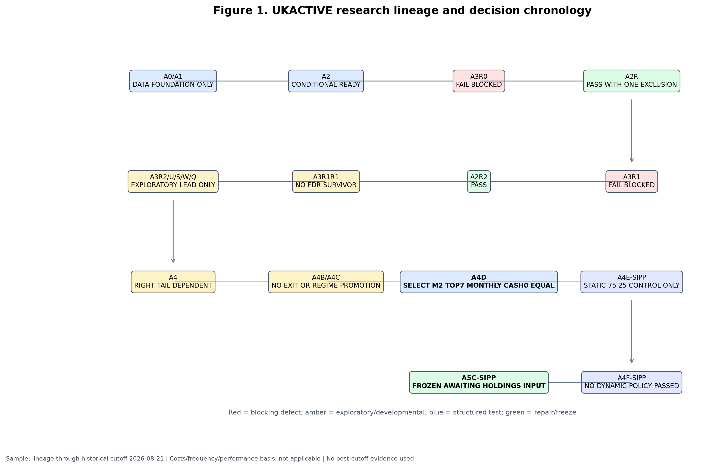

**Figure 1.** The lineage proceeds from data discovery through causal remediation, signal testing, portfolio architecture, falsification, SIPP translation and freeze. Arrows show scientific dependency, not automatic promotion. Sample and disposition details appear in the figure.

The chronology matters because later results cannot repair earlier causal defects retroactively. For example, the initially interesting A4 TOP1 result was not accepted as a finished strategy: its concentration led directly to the TOP3–TOP10 frontier. Likewise, the favourable recent CASH1 behaviour caused matched-exposure testing, which showed that much of its apparent defence could be obtained more effectively by holding a static lower-risk allocation. Each new test had a stated motivation, and failed additions were not silently retained.

## 4. Dataset and investable universe

### 4.1 Sources, units and calendar

The platform combined LSE listing discovery, curated internal identifiers, EODHD adjusted-price histories, European Central Bank foreign-exchange series for conversion to GBP, a reconstructed XLON session calendar and a time-varying SONIA-based GBP cash series. The accepted price field was adjusted close after data-quality validation; this incorporates distributions in the historical total-return representation. Prices denominated in pence sterling (GBX) were divided by 100 to obtain GBP before return construction. Foreign-currency histories were converted once to GBP. A GBP-traded line was not treated as currency hedged merely because its dealing currency was GBP.

The broad data foundation is larger than the frozen opportunity set. A0/A1 discovered 4,359 current LSE lines representing 2,821 distinct raw ISINs, curated them into 296 share classes, 478 listings and 99 economic-exposure families. A2 found 90 families with at least one usable history and 86 then ready for A3. The final M2 structural pool contains 27 industry-and-theme families; 25 had all five horizons at the cutoff and two remained in warm-up. These counts describe different funnels and must not be substituted for one another.

**Table 2. Dataset and universe funnel**

| Layer | Count | Meaning | Historical interpretation |
|---|---:|---|---|
| Raw LSE discovery lines | 4,359 | Current listings observed in discovery | Not a historical universe |
| Distinct raw ISINs | 2,821 | Raw identifiers before curation | Not all eligible or unique exposures |
| Curated share classes | 296 | Fund share-class records | May have several listing lines |
| Curated listings | 478 | Exchange trading lines | Ticker-level implementations |
| Curated economic families | 99 | Research exposure units | Roles extend beyond frozen M2 pool |
| A2 usable historical families | 90 | At least one accepted history | Coverage varies by horizon |
| A2 A3-ready families | 86 | Met the then-current readiness rule | Before later pool restrictions |
| Frozen M2 structural families | 27 | Industry-plus-theme family set | Point-in-time membership contract |
| Signal-ready at 2026-08-21 | 25 | All five M2 components available | Eligible at cutoff only |
| Warm-up at 2026-08-21 | 2 | Structural members lacking full formation | Receive no score until ready |

*Internal sources [DATA-01]–[DATA-10]: A0/A1 manifest and master counts at commit `2c26ad3639e4e025477d9415f4f7b707e9856b55`; A2 coverage CSV at the same commit; A5C frozen-spec fields at freeze commit `a8008f7709af3000a889bb234a86f8c520c4ed73`.*

At the A2 checkpoint, 89 families had at least one year of accepted history, 86 had three years, 77 had five years and 59 had ten years. Coverage does not imply contemporaneous eligibility for every strategy date. The common executable M2 window begins on 2017-03-01 because five-horizon formation, corrected histories and the selected pool first support a comparable portfolio then. The end is the immutable historical cutoff, 2026-08-21. Longer global-core history exists in the platform, but the final A4F longer-core-only result CSV is internally inconsistent and is quarantined in Section 18 rather than used for performance claims.

### 4.2 Listing, share class, family and implementation

An **ETF listing** is an exchange-specific trading line with a ticker, currency and venue. A **share class** is a legally defined fund interest identified by ISIN and may trade through multiple listings. An **economic-exposure family** is the research unit—for example, global semiconductors—designed to prevent economically duplicated funds from receiving multiple votes in a cross-section. The **ranked research unit** is that family. The **live implementation instrument** is the currently preferred GBP or GBX listing used only after the family has been selected.

This separation prevents a popular exposure with several near-identical lines from occupying multiple TOP7 slots. The family map also distinguishes preferred from alternate implementations. Alternates do not form extra historical observations. A current broker-confirmed line is a present implementation fact; it is never back-projected as proof that the same line was purchasable in 2017. Closures and incomplete histories remain missing or render a family ineligible according to the point-in-time contract.

## 5. Construction of the research data

### 5.1 Initial deficiencies and remediation

A2 assembled 367 historical routes plus four delisted routes, accepted 357 validated histories and produced a panel of 667,700 observations. It invalidated 1,842 stale observations and retained 62,667 in-life missing observations as missing rather than filling them. The latter distinction is essential: an absence is not evidence of a flat price. Forward filling would manufacture tradability, suppress volatility and leak stale values into lookback returns. (Internal sources [DATA-A2-PANEL] and [DATA-A2-MISSING]: A2 manifest and `UKACTIVE_A2_STALE_AND_MISSING_DATA_REPORT.csv`, commit `2c26ad3639e4e025477d9415f4f7b707e9856b55`.)

The first causal audit, A3R0, found 14 material family/history mismatches. A2R corrected 13, while `GLOBAL_BANKS` had no acceptable historical route and was excluded rather than proxied. Twenty-seven automated and 17 semantic checks supported that remediation. The second audit found a different problem: the vendor calendar included 29 dates that were not genuine XLON sessions. A2R2 reconstructed a deterministic exchange calendar, removed the false sessions and applied endpoint tolerances only across true sessions. (Internal sources [DATA-A2R-BLOCK], A3R0/A2R before-after audit, commit `2c26ad3`; [DATA-A2R2-CALENDAR] and [DATA-A2R2-ENDPOINT], A2R2 root-cause and gap policy, commit `0a5d32896e777c806dd3485650da1cd4d7660832`.)

### 5.2 Point-in-time histories and launch cohorts

Each family is eligible only after its accepted source history exists and all required lookbacks can be computed using information available by the review date. Launch cohorts therefore enter the denominator over time. A family cannot be assigned its current preferred ETF's earlier index history unless the canonical mapping explicitly established an accepted causal route. Endpoint matching may use the latest observation within three prior true XLON sessions, never a future date; a gap exceeding three sessions terminates the segment and requires a fresh valid observation. Genuine exchange holidays are not data failures.

Adjusted histories were normalised to GBP once. GBX was treated as a unit, not a currency. Foreign listing currency conversion used the accepted FX series; no second conversion was applied to a GBP line. Dividend treatment came through the adjusted/total-return basis. The time-varying cash series used SONIA with the documented day-count convention. Preferred and alternate live instruments are mapped only after an economic family has been selected. Suspended or unavailable live lines cannot be replaced discretionarily by an unapproved exposure.

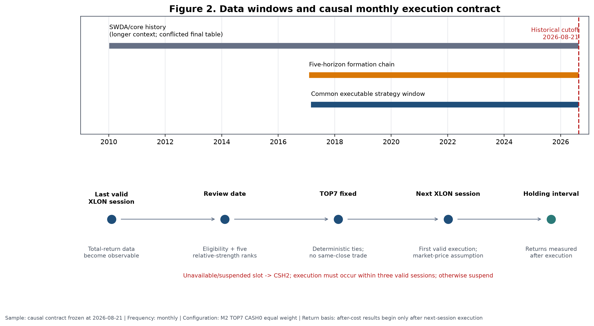

**Figure 2.** The common executable window is distinguished from formation history, broader corrected-panel diagnostics and the unresolved longer-core-only output. The lower panel shows the review-to-execution contract. Costs are not applicable to the calendar schematic.

**Table 3. Material point-in-time and data assumptions**

| Assumption | Rationale | Potential bias | Direction | Mitigation / residual limitation |
|---|---|---|---|---|
| Adjusted close represents total return | Distributions must enter cross-horizon performance | Vendor adjustments may be imperfect | Ambiguous | Validation and route audits; residual vendor risk |
| GBP and GBX normalised before returns | Avoid 100-fold unit discontinuity | Unit metadata error | Either | Explicit currency/unit mapping and correctness tests |
| Foreign histories converted once to GBP | SIPP investor measures wealth in GBP | FX timing or source error | Ambiguous | ECB series and deterministic conversion; unhedged exposure remains |
| No forward fill | Prevent invented tradability and stale prices | Excludes some recoverable observations | Probably downward for coverage; return bias ambiguous | Missing remains missing; causal segment reset |
| Three-session prior-only endpoint tolerance | Accommodate genuine asynchronous data arrival | May admit slightly stale observation | Ambiguous | Only true prior XLON sessions; never future; >3 resets |
| Current broker availability not back-projected | Present availability is not historical evidence | Reduces claimed implementability | Affects generalisability | Separate family research from live map |
| Economic-family duplicate suppression | Prevent multiple listings receiving multiple ranks | Taxonomy may merge imperfect substitutes | Ambiguous | Frozen mapping; semantic review; no discretionary remap |
| Absent family receives no proxy | Avoid look-ahead and subjective substitution | Narrows opportunity set | Ambiguous | Cash slot operationally if selected line unavailable |
| Historical cash follows time-varying SONIA | Avoid fixed-rate hindsight | Proxy differs from broker products | Ambiguous | Separate RLON, CSH2 and broker cash roles |
| Market-price execution plus 20 bps one-way | Conservative retail implementability | May overstate or understate actual shortfall | Likely conservative but uncertain | Prospective fills and costs recorded |

*Internal sources: [DATA-A2-MISSING], [DATA-A2R-BLOCK], [DATA-A2R2-CALENDAR], [DATA-A2R2-ENDPOINT], [CASH-SONIA], [M2-TIMING] and [COST-HIST]; exact artefacts, commits and fields are in the evidence matrix.*

## 6. Causal timing and execution contract

The signal timestamp is the final valid XLON session of a calendar month. All prices, eligibility flags and benchmark returns used in the score must be known at or before that review close. The selected portfolio is not assumed to transact at that same close. Execution occurs on the first valid following XLON session, within a maximum three-session window. If the execution window cannot be met, the run is suspended rather than retrospectively shifted to a favourable price.

Same-close execution would be non-causal because the research system would use the review close both to determine the rank and to claim a fill at a price that was not available until the signal-defining session completed. The next-session rule creates a clean separation between observation and action. Return measurement begins from the canonical execution price and continues until the next rebalance contract.

The frozen contract permits no leverage, shorting or discretionary substitutions. In a prospective run, an unavailable or suspended selected family slot is placed in CSH2; it is not replaced with the next-ranked family or an unapproved alternate. A temporarily short eligible list can support fewer than seven positions only under the exact frozen code rule; with three to six eligible families the selected set is equal-weighted across those available. Fewer than three valid families fails the ranking contract.

*Internal source [M2-TIMING]: A5C, `UKACTIVE_A5C_SIPP_FROZEN_SPEC.json`, freeze commit `a8008f7709af3000a889bb234a86f8c520c4ed73`, execution-contract and suspension fields.*

## 7. Benchmark and cash definitions

### 7.1 Global benchmark

`GLOBAL_DEVELOPED_WORLD` is the strategic equity benchmark. In the frozen current implementation it maps to the iShares Core MSCI World UCITS ETF GBP line, SWDA (`IE00B4L5Y983`). It represents a practical global developed-equity core, not a matched industry/theme opportunity set.

### 7.2 Opportunity-set benchmark

The contemporaneous equal-weight `INDUSTRY_PLUS_THEME` pool is the scientific opportunity benchmark. At each date it averages the eligible family returns rather than freezing today's 27 families through history. This comparator asks whether M2 added value through cross-sectional ordering, beyond merely being exposed to an industry-and-theme universe that itself might outperform or underperform SWDA. A result above SWDA but below the equal pool would not demonstrate ranking value.

### 7.3 Cash

Historical cash is the accepted time-varying GBP SONIA series. It was not assigned a constant 4% return. Pre-2022 short rates were materially lower than rates observed later; therefore a static 4% backfill would overstate historical defensive returns. Live instruments have distinct roles: broker cash settles trades and pays small residual costs; CSH2 (`LU1230136894`) is tactical liquidity and receives unavailable M2 slots; RLON is intended for strategic defence, but its exact current share-class identity remained unresolved at A5C. The return on RLON or CSH2 depends on prevailing rates and product tracking. Selecting them prospectively does not replace the historical cash proxy.

*Internal source [CASH-SONIA]: A2, `UKACTIVE_A2_CASH_MODEL.md`, commit `2c26ad3639e4e025477d9415f4f7b707e9856b55`; current roles from [LIVE-MAP], A5C live instrument map, results commit `beb8d49828b9819aa167d2e07ffdc2b92581b36b`.*

## 8. Signal construction

For eligible family (i), review date (t), benchmark (B), and horizon (h\in\{21,42,63,126,252\}), the code first forms cumulative total returns (R_{i,t,h}) and (R_{B,t,h}) over the same sessions. Raw benchmark-relative return is

\[
RS^{\mathrm{raw}}_{i,t,h}=\frac{1+R_{i,t,h}}{1+R_{B,t,h}}-1.
\]

The cross-section of raw values is converted to an average-tie percentile using the eligible denominator at (t):

\[
RS_{i,t,h}=\operatorname{PercentileRank}_{j\in\mathcal{E}_t}\left(RS^{\mathrm{raw}}_{j,t,h}\right).
\]

All five components must exist; otherwise the family has no M2 score. At least three families must be valid for cross-sectional ranking. Ties receive their average percentile. Final portfolio ordering is descending M2 and, for any exact composite tie, ascending canonical family identifier.

The frozen composite is

\[
M2_{i,t}=0.10RS21_{i,t}+0.15RS42_{i,t}+0.25RS63_{i,t}+0.30RS126_{i,t}+0.20RS252_{i,t}.
\]

**Table 4. Frozen signal definitions and weights**

| Component | Sessions | Approximate role | Weight | Representation |
|---|---:|---|---:|---|
| RS21 | 21 | Fast information | 0.10 | Eligible cross-sectional percentile of benchmark-relative total return |
| RS42 | 42 | Fast/intermediate confirmation | 0.15 | Same convention |
| RS63 | 63 | Three-month persistence | 0.25 | Same convention |
| RS126 | 126 | Six-month leadership | 0.30 | Same convention |
| RS252 | 252 | Slow structural leadership | 0.20 | Same convention |
| **M2** | Five horizons | Multi-horizon composite | **1.00** | Weighted sum; all components required |

*Internal source [M2-FORMULA]: A5C frozen spec at freeze commit `a8008f7709af3000a889bb234a86f8c520c4ed73`; code confirmation in immutable A4D/A5C signal implementation, fields for return convention, percentile method and weights.*

M2 assigns 55% to the 63- and 126-session components and 75% to 63, 126 and 252 sessions together. It is therefore intermediate-weighted rather than dominated by the most recent month. The intended interpretation is that the short components register new information, the intermediate components capture persistence, and the annual component recognises structural leadership. That mechanism is plausible rather than proven. Percentile standardisation also means the score measures relative position within the eligible cross-section, not an absolute expected return.

## 9. Portfolio construction

At each monthly review, eligible economic families are sorted by M2; the first seven are selected and assigned equal target weights of (1/7\approx14.29\%\) within the standalone sleeve. Ranking families rather than tickers suppresses duplicate or near-duplicate exposure. Mapping to a preferred GBP/GBX line occurs after selection. A family leaving the TOP7 is sold at the next execution; a new family is bought; retained families are rebalanced to equal weight under the cost model. No discretionary intra-month exit is permitted.

Turnover is traded notional—purchases plus sales relative to portfolio value—annualised under the originating calculation. A family replacement typically creates a sale leg and a purchase leg. Because weights drift, turnover and replacement rate are related but not identical.

TOP7 is not presented as a uniquely optimal integer. The breadth frontier later showed a broad TOP6–TOP9 region, with different members leading on different metrics and windows. TOP8 had the highest latest-five-year historical CAGR, while TOP6 had the highest full-history CAGR. TOP7 was chosen as a central, representative specification that avoided claiming the highest cell in either view. This decision reduces, but does not remove, selection risk.

## 10. Transaction-cost model

The canonical historical model charges 20 bps one-way on traded notional and uses a market-price execution assumption. Fixed dealing fees are applied by trade leg under the relevant Interactive Investor plan. For A5C, Plus charges £3.99 per paid ETF leg with one monthly free-trade credit and a £14.99 monthly subscription; Premium charges £2.99 per paid ETF leg, two monthly credits and a £39.99 monthly subscription. The subscription is normally reported separately from incremental M2 cost because it supports the whole account, while an all-in subscription-deducted result is also shown. Fund total expense ratios are not deducted twice: the accepted adjusted-price histories already reflect realised fund performance.

Preferred lines deal in GBP or GBX, so no broker foreign-exchange transaction fee is deducted on those trades. This does not remove the foreign-currency exposure of the underlying holdings. A GBP line can remain economically unhedged; underlying currency returns affect NAV without constituting a broker FX conversion charge.

**Table 5. Live and historical cost assumptions**

| Item | Frozen assumption | Scientific treatment |
|---|---|---|
| Proportional friction | 20 bps one-way | Baseline historical and pilot calculations |
| Stress | 40 bps one-way | Doubled-cost sensitivity; no model reselection |
| Execution reference | Market-price | Midpoint fills not assumed |
| Plus dealing fee | £3.99 per paid ETF leg | One monthly credit |
| Premium dealing fee | £2.99 per paid ETF leg | Two monthly credits |
| Plus subscription | £14.99 per month | Separate and all-in views |
| Premium subscription | £39.99 per month | Separate and all-in views |
| Preferred-line broker FX fee | £0 | GBP/GBX dealing lines only |
| Underlying currency risk | Retained | GBP dealing does not imply hedging |
| ETF TER | No extra deduction | Reflected in adjusted histories |

*Internal source [COST-HIST]: A5C frozen spec, freeze commit `a8008f7709af3000a889bb234a86f8c520c4ed73`, cost-policy fields; A5C cost restatement at results commit `beb8d49828b9819aa167d2e07ffdc2b92581b36b` for plan-specific outputs.*

At the current £563,000 illustration, the target wrapper translates to £365,950 SWDA, £56,300 M2 and £140,750 defensive assets; each of seven M2 families is approximately £8,042.86. These are scale illustrations, not orders. The market-price assumption was retained because midpoint execution could understate retail shortfall. Actual prospective fills, spreads and charges must be recorded rather than inferred from the backtest.

A manual spot-spread review was conducted outside the canonical research repository; it is not used as formal historical evidence.

## 11. Experimental design

### 11.1 Literature as an external prior

Cross-sectional momentum has a long empirical literature, beginning with security-level continuation and extending across industries and asset classes [JegadeeshTitman1993; MoskowitzGrinblatt1999; AsnessMoskowitzPedersen2013]. Time-series momentum is conceptually different because an asset is judged against its own history rather than ranked against peers [MoskowitzOoiPedersen2012]. UKACTIVE is principally cross-sectional: a family's benchmark-relative return is standardised against other eligible families. Its use of several horizons and an annual relative-return component nevertheless makes time-series persistence relevant as mechanism context.

The literature also supplies reasons for caution. Momentum can suffer sharp reversals after stressed markets [DanielMoskowitz2016]. Volatility management has improved some historical momentum portfolios [BarrosoSantaClara2015], but that does not imply that a particular volatility overlay will work in an ETF sleeve. Industry-level dispersion may condition momentum payoffs [StiversSun2010]. ETF studies have found that country or industry effects can sometimes be implemented after trading costs, but results differ by universe, era and design [AndreuSwinkelsTjongATjoe2013; Tse2015; VanstoneHahnEarea2021; YuWebbWangChiou2020]. Trading-cost work shows that paper anomalies can disappear under realistic implementation [NovyMarxVelikov2016].

The testing problem is equally important. Searching many specifications makes the maximum historical result a biased estimator [White2000; Hansen2005; HarveyLiuZhu2016]. Backtest-overfitting frameworks formalise the risk that a selected strategy is an artefact of repeated reuse of the same sample [BaileyBorweinLopezDePradoZhu2017]. Survivorship can overstate performance when failed products disappear [BrownGoetzmannIbbotsonRoss1992]. These sources motivated point-in-time eligibility, multiple-testing ledgers, randomised controls, influence tests and a final model freeze. Published evidence provides an external prior and mechanism context; it is not UKACTIVE evidence.

### 11.2 Sequential rather than Cartesian testing

The programme avoided an unrestricted Cartesian product of signals, horizons, breadths, frequencies, cash rules, weights, exits and regimes. It proceeded sequentially:

1. establish causal data and signal definitions;
2. identify a multi-horizon family worth economic testing;
3. map the breadth frontier;
4. compare rebalance frequencies under costs;
5. test cash defence;
6. compare simple weighting rules;
7. falsify against random selection and rank shuffling;
8. test matched-risk and matched-exposure controls;
9. describe causal regimes and test predeclared policies;
10. construct static core/satellite wrappers; and
11. freeze the final specification.

This ordering reduced, but did not eliminate, multiple-use bias. Later stages were preregistered in immutable specifications and wrote machine-readable outputs and manifests. The historical cutoff was fixed at 2026-08-21. There is no untouched historical holdout: every part of the executable 2017–2026 window informed at least one stage of development or assessment. The correct scientific response is not to relabel the final backtest as out-of-sample; it is to close development and observe the frozen rule prospectively.

Permitted paper computations reproduce or explain completed tests. Figures 5, 6, 8 and 16 deterministically transform canonical daily or monthly paths; Figure 11 exactly reruns the frozen randomisation algorithm to recover the distribution arrays, with assertions against the canonical summary. None of those computations changes selection.

## 12. Initial signal tests

The early A3 programme tested whether simple trend and relative-strength descriptors had forward ranking content. It did not test the complete frozen M2 TOP7 monthly portfolio. The work included isolated momentum measures, trend qualifications, family and group contexts, several forward horizons, top-tail rules and statistical adjustments. The purpose was signal discovery and causal interface validation, not a live allocation claim.

The results were mixed. Directional evidence appeared in some cells, but support was weak, context-dependent and sensitive to the specification. A3R1R1 contained 180 multiple-testing cells; none had a Benjamini–Hochberg q-value at or below 0.10, and no positive bootstrap lower bound established a broad survivor. A3R2 expanded portfolio-level comparisons to 315 specifications and again found no q-value below 0.10. The exploratory TOP1 lead was therefore carried forward only as a research candidate. (Internal sources: A3R1R1, `UKACTIVE_A3R1R1_MULTIPLE_TESTING_LEDGER.csv` and `UKACTIVE_A3R1R1_DECISION.json`, commit `c30de89d0ceee74ea024708e7c95270bae38d150`; A3R2, `UKACTIVE_A3R2_MULTIPLE_TESTING_LEDGER.csv` and decision JSON, commit `32e6388a02689fd932b348aa20695f93c6199d5e`.)

The negative result changed the claim, not the data. It ruled out describing isolated trend qualification as a statistically established effect. It also suggested that the useful object might be a portfolio-level composite rather than any single horizon. M2 was subsequently justified as a predeclared intermediate-weighted extension, compared with an equal-horizon control and a more complex deterioration-aware variant. A3 did not retrospectively become evidence for that exact frozen architecture.

## 13. Multi-horizon signal comparison

M1 assigned equal influence to the five horizons. M2 tilted toward three- and six-month information. M3 added a fast-aware structural deterioration penalty to M2. The Stage A diagnostic gate counted positive IC horizons and positive top-quintile horizons, while the economic stage compared after-cost portfolios.

**Table 6. Multi-horizon signal comparison**

| Signal | Positive IC horizons | Positive top-quintile horizons | Stage A gate | Full net CAGR | Full excess vs equal pool | Full MDD | Latest-5y net CAGR | Latest-5y excess vs pool | Full turnover |
|---|---:|---:|---|---:|---:|---:|---:|---:|---:|
| M1 equal five-horizon | 3 | 0 | Fail | 12.52% | 0.99 pp | −24.95% | 11.07% | 0.08 pp | 6.43× |
| **M2 intermediate-weighted** | 3 | 2 | Pass | **13.14%** | **1.61 pp** | **−23.53%** | **13.62%** | **2.63 pp** | **5.52×** |
| M3 deterioration-aware | 3 | 2 | Pass | 11.77% | 0.24 pp | −23.53% | 11.34% | 0.35 pp | 5.96× |

*Sample: 2017-03-01–2026-08-21; latest five years 2021-09-01–2026-08-21; baseline 20 bps one-way plus fixed fee; monthly TOP7 CASH0 equal weight; net returns. Internal sources [SIG-M1_EQUAL_5H], [SIG-M2_INTERMEDIATE_5H], [SIG-M3_STRUCTURAL_DETERIORATION]: A4D robustness results, commit `f411e0d169640a5120decee6940dc8a5769c3b5e`.*

At a representative weekly diagnostic, M2's 21-, 42- and 63-session rank ICs were 0.0240, 0.0220 and 0.0516; corresponding top-quintile forward-return diagnostics were 0.000711, −0.000510 and 0.001785 in source units. These values show weak positive ordering at some horizons, not a uniformly monotonic effect. The HAC inference ledger found no q-value at or below 0.10. (Internal source: A4D, `UKACTIVE_A4D_SIGNAL_HAC_INFERENCE.csv`, commit `f411e0d`, weekly 21/42/63-session rows.)

M2 was selected despite the absence of broad adjusted significance because it combined the better completed diagnostic gate with the strongest economic result of the three preregistered composites, lower turnover than M1, and less complexity than M3. That is an economic-selection argument under developmental evidence. It is not independent confirmation. M3's penalty did not improve portfolio return or drawdown; retaining it would have added a failure-prone state variable without compensating value.

## 14. Breadth frontier

The A4 TOP1 investigation had a striking recent result but extreme contributor concentration. A4D therefore tested every integer breadth from TOP3 through TOP10 under the same M2, monthly, CASH0, equal-weight and cost rules. Concentrated TOP3–TOP4 portfolios were poor on full-history drawdown and unstable on recent return. Performance improved through TOP6–TOP8, flattened across TOP6–TOP9 depending on metric and window, then diluted at TOP10.

**Table 7. Complete after-cost breadth frontier**

| Breadth | Full net CAGR | Full excess vs pool | Full MDD | Full turnover | Latest-5y net CAGR | Latest-5y excess vs pool | Latest-5y MDD | Latest-5y turnover |
|---:|---:|---:|---:|---:|---:|---:|---:|---:|
| TOP3 | 10.40% | −1.13 pp | −28.03% | 9.80× | 7.42% | −3.57 pp | −26.34% | 11.33× |
| TOP4 | 11.59% | 0.06 pp | −27.88% | 9.35× | 8.77% | −2.22 pp | −27.88% | 10.37× |
| TOP5 | 13.23% | 1.70 pp | −28.31% | 7.46× | 11.83% | 0.84 pp | −28.31% | 8.66× |
| TOP6 | **13.50%** | **1.97 pp** | −24.36% | 6.25× | 12.64% | 1.65 pp | −24.11% | 7.48× |
| **TOP7** | **13.14%** | **1.61 pp** | **−23.53%** | **5.52×** | **13.62%** | **2.63 pp** | **−22.34%** | **6.93×** |
| TOP8 | 13.15% | 1.61 pp | −23.54% | 4.85× | **14.75%** | **3.76 pp** | −20.10% | 6.29× |
| TOP9 | 11.50% | −0.03 pp | −25.14% | 4.61× | 12.46% | 1.47 pp | −21.65% | 6.21× |
| TOP10 | 10.22% | −1.31 pp | −24.71% | 4.10× | 10.56% | −0.43 pp | −19.86% | 5.62× |

*Samples: full 2017-03-01–2026-08-21; latest five years 2021-09-01–2026-08-21. Baseline 20 bps one-way plus fixed fee; monthly M2 CASH0 equal weight; net returns; opportunity benchmark is contemporaneous equal-weight pool. Internal sources [BR-3]–[BR-10]: `UKACTIVE_A4D_BREADTH_RESULTS.csv`, A4D commit `f411e0d`.*

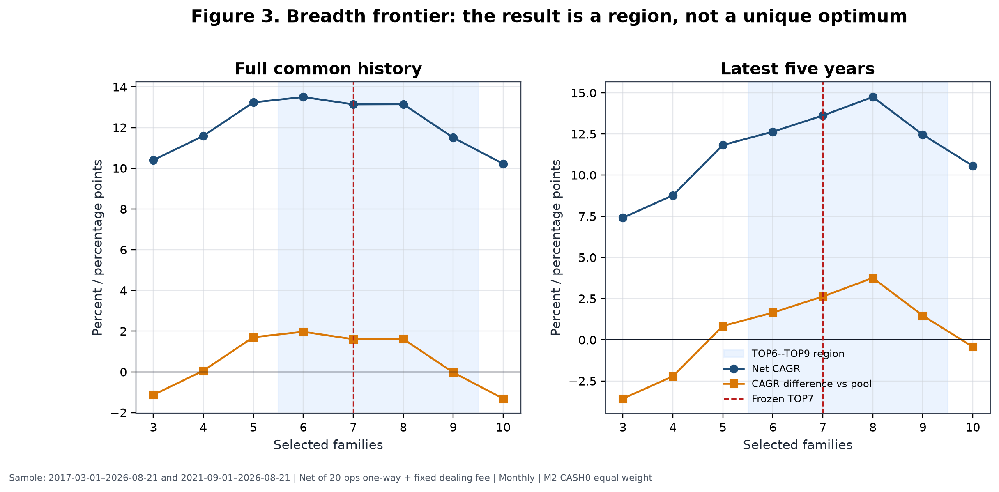

**Figure 3.** Full-history and latest-five-year return, drawdown and turnover show a region rather than a unique optimum. TOP7 is marked as the representative frozen point. All M2 paths are net of baseline costs.

Why not TOP8? TOP8 had the highest latest-five-year CAGR and the shallowest recent drawdown among TOP3–TOP9, but selecting it for that reason would maximise a recent exposed-history cell. TOP6 had the highest full-history CAGR. TOP7 sat between those cells, had nearly identical full-history economics to TOP8, materially lower turnover than TOP6, and represented the centre of the viable region. The conclusion is “moderately diversified high-rank basket,” not “seven is structurally optimal.”

Turnover fell almost monotonically with breadth because one family change affected a smaller portfolio fraction. At the same time, excessive breadth diluted rank separation: TOP10 fell below the pool on both full and recent windows. Concentration and dilution are therefore competing errors.

## 15. Rebalance-frequency tests

Daily, weekly and monthly implementations used the same signal family, breadth, cash and weight logic but different review schedules. Gross daily CAGR was highest, yet daily turnover of 31.86× produced 8.40 pp of CAGR drag at baseline costs. Weekly remained economically plausible, while monthly combined the lowest turnover with the strongest baseline MDD and the only positive doubled-cost excess versus the equal pool.

**Table 8. Rebalance-frequency comparison**

| Frequency | Gross CAGR | Net CAGR | Net excess vs pool | Doubled-cost net CAGR | Doubled-cost excess vs pool | MDD | Ulcer | Turnover | Cost drag | Avg holding days | Replacement rate | Legs |
|---|---:|---:|---:|---:|---:|---:|---:|---:|---:|---:|---:|---:|
| Daily | 18.04% | 9.64% | −2.77 pp | 0.91% | −11.50 pp | −28.10% | 9.00% | 31.86× | 8.40 pp | 23.85 | 15.15% | 7,699 |
| Weekly | 16.76% | 13.39% | 1.10 pp | 10.03% | −2.26 pp | −25.98% | 6.98% | 13.18× | 3.37 pp | 57.54 | 17.48% | 2,800 |
| **Monthly** | 14.48% | **13.14%** | **1.61 pp** | **11.80%** | **0.27 pp** | **−23.53%** | 8.20% | **5.52×** | **1.34 pp** | **134.38** | 25.22% | **865** |

*Sample: 2017-03-01–2026-08-21. M2 TOP7 CASH0 equal weight; net metrics use 20 bps one-way plus fixed fee; doubled-cost metrics use 40 bps one-way. Internal sources [FREQ-DAILY], [FREQ-WEEKLY], [FREQ-MONTHLY]: `UKACTIVE_A4D_FREQUENCY_RESULTS.csv`, A4D commit `f411e0d`.*

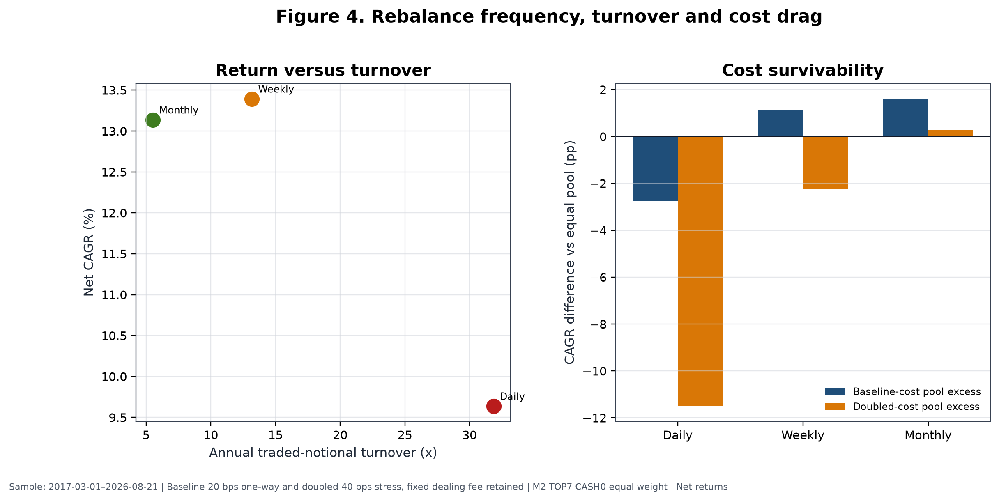

**Figure 4.** Higher review frequency increased gross responsiveness but also replacement opportunities, trade legs and proportional friction. The monthly choice was based on the joint after-cost profile, not merely its raw return.

Weekly's baseline net CAGR was 0.26 pp above monthly, but its MDD was 2.45 pp deeper and its turnover more than twice as large. Under doubled costs its excess versus the equal pool reversed to −2.26 pp, whereas monthly retained +0.27 pp. Daily was dominated by noise and trading intensity. Monthly was thus the most defensible operating frequency even though it did not maximise every metric.

## 16. Cash and defensive-overlay tests

A4D tested five architectures. CASH0 always invested the selected risky families. CASH1 admitted cash family by family using a 252-session relative-to-cash rule. CASH2 used pool breadth, CASH3 required global confirmation, and CASH4 combined defensive conditions. The exact definitions are reproduced in the supplement; Table 9 reports the central outcomes.

**Table 9. Cash and defensive architectures**

| Rule | Full net CAGR | Full excess vs pool | Full MDD | Full Ulcer | Full Calmar | Avg cash weight | Latest-5y net CAGR | Latest-5y excess vs pool | Latest-5y MDD |
|---|---:|---:|---:|---:|---:|---:|---:|---:|---:|
| **CASH0 always invested** | **13.14%** | **1.61 pp** | **−23.53%** | **8.20%** | **0.56** | **0.00%** | **13.62%** | **2.63 pp** | −22.34% |
| CASH1 individual above cash | 9.53% | −2.00 pp | −27.16% | 8.32% | 0.35 | 17.54% | 13.21% | 2.22 pp | **−18.92%** |
| CASH2 breadth defence | 6.96% | −4.57 pp | −32.18% | 11.11% | 0.22 | 28.63% | — | — | — |
| CASH3 global confirmation | 8.35% | −3.18 pp | −25.51% | 10.89% | 0.33 | 27.43% | — | — | — |
| CASH4 combined defence | 5.79% | −5.74 pp | −21.56% | 10.13% | 0.27 | 46.30% | — | — | — |

*Samples: full 2017-03-01–2026-08-21; latest five years 2021-09-01–2026-08-21. Baseline costs, monthly M2 TOP7 equal weight; net returns. Dashes indicate values omitted from the concise table, not unrun tests; full rows are in the supplement. Internal sources [CASH-0]–[CASH-4]: `UKACTIVE_A4D_CASH_DEFENCE_RESULTS.csv`, A4D commit `f411e0d`.*

CASH1 is the most instructive failure. In the latest five years it reduced MDD to −18.92% while retaining 13.21% CAGR and a positive 2.22 pp pool excess. On the full window, however, CAGR fell to 9.53%, the pool difference reversed to −2.00 pp, MDD worsened to −27.16%, and average cash weight was 17.54%. Its apparent recent success was not stable.

Matched-exposure controls then asked whether CASH1 timed risk or simply held less. A static portfolio with the same average rotation exposure produced 11.27% CAGR and −19.64% MDD, versus CASH1's 9.53% and −27.16%. A global/cash comparator at the same average exposure produced 9.96% and −21.38%. CASH1 failed both comparisons. (Internal source: A4E-SIPP, `UKACTIVE_A4E_SIPP_MATCHED_EXPOSURE_CONTROLS.csv`, commit `6eef0e413a2ee269bd5748cb244ce4f19577723a`, CASH1 matched-exposure rows.)

Global confirmation and combined defence sacrificed still more return. A separate binary 252-session global/cash rule compounded at 6.82% with a −25.58% MDD and retained only 58.8% of the global-core return; it failed promotion. These results distinguish **holding less risk**, which can mechanically reduce some losses, from **successfully timing risk**, which must outperform a static comparator with similar exposure after costs. No tested cash rule did so. The scientific active strategy therefore remains CASH0, while the whole SIPP separately holds a fixed defensive budget.

## 17. Weighting, deterioration and momentum-age tests

Equal weighting was compared with a bounded rank-decay scheme and a fixed top-heavy scheme. Concentrating capital toward the highest ranks did not improve the full-window outcome and increased turnover.

**Table 10. Weighting comparison**

| Weighting | Full net CAGR | Full excess vs pool | Full MDD | Full turnover | Decision |
|---|---:|---:|---:|---:|---|
| **Equal** | **13.14%** | **1.61 pp** | **−23.53%** | **5.52×** | Retained |
| Bounded rank decay | 12.40% | 0.87 pp | −25.95% | 8.14× | Rejected |
| Fixed top-heavy | 12.02% | 0.49 pp | −25.25% | 7.57× | Rejected |

*Sample: 2017-03-01–2026-08-21; baseline costs; monthly M2 TOP7 CASH0; net returns. Internal sources [WT-W0_EQUAL], [WT-W1_RANK_DECAY], [WT-W2_FIXED_TOP_HEAVY]: `UKACTIVE_A4D_WEIGHTING_RESULTS.csv`, A4D commit `f411e0d`.*

A4B and A4C also examined fast tapers, maximum-favourable-excursion giveback locks, strength harvesting, deceleration, early participation, volatility sizing and trend-failure exits. The modules frequently exited or reduced the very mature trends that generated the right tail. Early-participation variants either lost terminal wealth or worsened drawdown; trend-failure exits had negative net monetisation value; volatility targeting reduced drawdown but retained too little of the top-three contribution for standalone promotion. (Internal sources: A4B `UKACTIVE_A4B_MODULE_DECISIONS.csv`; A4C `UKACTIVE_A4C_MODULE_DECISIONS.csv`; commit `1802820f9a4201847b13c7526b5170e27309983a`.)

Momentum-age diagnostics classified states such as mature or decelerating, but ex-post association did not become a causal exit rule. A mature trend can be near its end or in the middle of a much larger move. No completed test justified a fast exit, age rule, deterioration override or discretionary sell. M3's inferior economic result reinforced that conclusion. The frozen model exits only through the next monthly cross-sectional rank.

## 18. Full-history economic results

Table 11 places the principal strategies on the identical 2017-03-01 to 2026-08-21 executable window. The equal pool path is a deterministic diagnostic from the canonical A4D equity curve; the other rows are the final A4F static frontier. Metrics are net under their stated historical cost treatment. The static controls are not active-edge candidates.

**Table 11. Full common-window strategy comparison**

| Strategy | Net CAGR | Wealth / £100k | MDD | Calmar | Ulcer | Volatility | Longest underwater | Turnover | Cost drag |
|---|---:|---:|---:|---:|---:|---:|---:|---:|---:|
| SWDA/global 100% | 11.60% | £282,859 | −25.58% | 0.45 | 4.89% | 14.57% | 586 d | 0.11× | 0.00 pp |
| 75% SWDA / 25% cash control | 9.26% | £231,457 | −19.55% | 0.47 | **3.60%** | **10.88%** | **550 d** | 0.14× | 0.03 pp |
| **M2 TOP7 100%** | **13.14%** | **£321,979** | −23.53% | 0.56 | 8.20% | 18.49% | 857 d | 5.52× | 1.34 pp |
| 50% SWDA / 50% M2 | 12.40% | £302,751 | −23.62% | 0.53 | 5.89% | 15.87% | 763 d | 2.89× | 0.77 pp |
| Equal-weight opportunity pool | 11.53% | £281,204 | −28.30% | 0.41 | 6.52% | 16.77% | 444 d | — | — |
| 50% SWDA / 25% M2 / 25% cash | 9.62% | £238,807 | **−18.44%** | 0.52 | 3.89% | 11.48% | 735 d | 1.50× | 0.46 pp |
| 75% M2 / 25% cash | 10.46% | £256,644 | −17.95% | 0.58 | 5.95% | 13.84% | 816 d | 4.18× | 1.04 pp |
| 50% M2 / 50% cash | 7.68% | £201,542 | −12.16% | 0.63 | 3.74% | 9.21% | 764 d | 2.81× | 0.73 pp |

*Common sample: 2017-03-01–2026-08-21; monthly M2 TOP7 CASH0 equal weight; baseline costs; net results. Internal sources [ECON-GLOBAL_100]–[ECON-M2_TOP7_CASH0_75_CASH25]: A4F static frontier, commit `6dba072dce65da56284a8c02f9f380301048d492`; [ECON-EQUAL_WEIGHT_OPPORTUNITY_POOL]: canonical A4D equity-curve parquet, historical source commit `48cb69ffbaae25eb0dccc3226f47f5a7491e8bd7`, derived diagnostic.*

M2's full-history CAGR difference was 1.54 pp versus SWDA and 1.61 pp versus the equal pool. Its terminal wealth was highest, but so were annualised volatility, Ulcer and underwater duration among the main core/blend rows. M2 reduced MDD relative to SWDA by 2.05 pp, yet its larger Ulcer and 857-day underwater period show that risk reduction cannot be inferred from one drawdown statistic. The 75/25 control had substantially lower volatility and Ulcer because it held less equity; it is capital continuity, not timing skill.

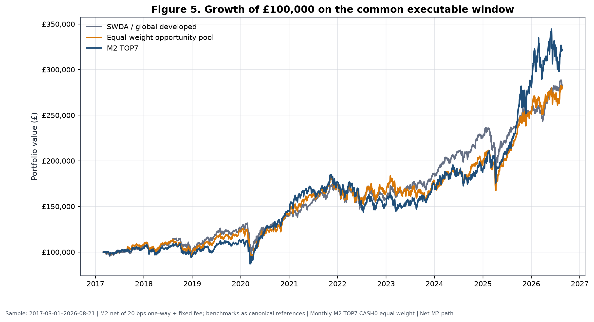

**Figure 5.** Growth of £100,000 for M2, SWDA/global developed and the equal-weight opportunity pool on the common window. M2 is net of baseline costs; comparator conventions follow canonical reference paths.

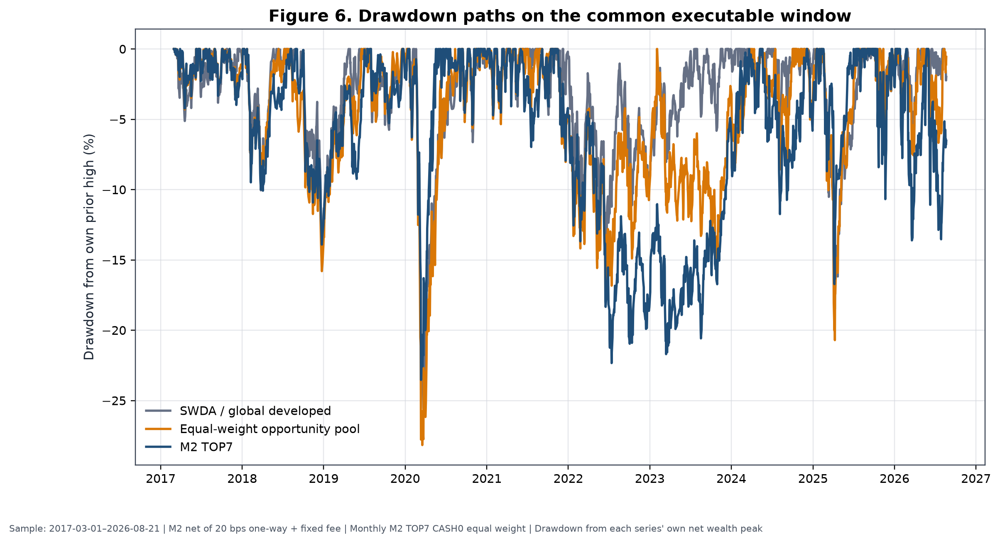

**Figure 6.** Drawdowns from each series' own wealth peak. M2's advantage was not a uniformly smoother path; prolonged 2022–2024 relative weakness is visible.

Metric definitions explain apparently conflicting “excess” values. The 1.61 pp figure is a full-window difference in geometric CAGRs versus the pool. A full-history daily arithmetic annualised return difference was 4.3864%, while the latest-five-year monthly bootstrap used an observed arithmetic annualised difference of 2.9385%. They are different estimands, frequencies and windows, not contradictory measurements. (Internal source: A4E, `UKACTIVE_A4E_SIPP_METRIC_RECONCILIATION.csv`, commit `6eef0e4`; A4D bootstrap at `f411e0d`.)

**Unresolved longer-core conflict.** The A4F reproduction narrative identifies a longer core-only context from 2010-01-08 to 2026-08-21. The final machine-readable `UKACTIVE_A4F_SIPP_LONGER_CORE_ONLY_RESULTS.csv` contains only dates 2010-03-01 to 2010-03-09 and implausible annualised results. Under the evidence hierarchy this is `UNRESOLVED_SOURCE_CONFLICT`. No longer-window return statistic is reported or compared with the 2017–2026 rotation result. (Internal source [LONG-CORE-CONFLICT], A4F commit `6dba072`.)

## 19. Year-by-year performance

Calendar-year decomposition shows why the full CAGR cannot be interpreted as a stable annual premium. The first and last years are partial. The 10% pilot column is its return difference from the 75/25 control, not its absolute whole-SIPP return.

**Table 12. Calendar-year net performance**

| Year | SWDA | 50/50 SWDA/M2 | 100% M2 | Equal pool | 75/25 control | 10% pilot minus control |
|---|---:|---:|---:|---:|---:|---:|
| 2017* | 5.27% | 4.62% | 4.27% | 7.89% | 3.99% | −0.15 pp |
| 2018 | −3.78% | −6.15% | −8.36% | −8.98% | −2.53% | −0.52 pp |
| 2019 | 23.03% | 19.55% | 16.18% | 24.43% | 17.10% | −0.70 pp |
| 2020 | 12.25% | 20.92% | **30.38%** | 14.99% | 9.64% | **1.60 pp** |
| 2021 | 23.64% | 22.75% | 21.74% | 23.51% | 17.33% | −0.18 pp |
| 2022 | −8.33% | −11.30% | −14.23% | −5.04% | −5.85% | −0.62 pp |
| 2023 | 17.59% | 16.95% | 16.10% | 8.41% | 14.24% | −0.14 pp |
| 2024 | 21.11% | 14.08% | 7.46% | 9.73% | 16.96% | −1.41 pp |
| 2025 | 12.64% | 29.74% | **48.90%** | 28.16% | 10.55% | **3.20 pp** |
| 2026* | 11.23% | 13.18% | 14.67% | 11.93% | 9.00% | 0.41 pp |

*Samples: 2017 begins 2017-03-01; 2026 ends 2026-08-21. Baseline costs; monthly M2 TOP7 CASH0 equal weight; net returns. Internal sources [YEAR-2017]–[YEAR-2026]: A4F year scorecard at commit `6dba072`; A5C relative-regret/calendar rows at results commit `beb8d49` for pilot-control differences.*

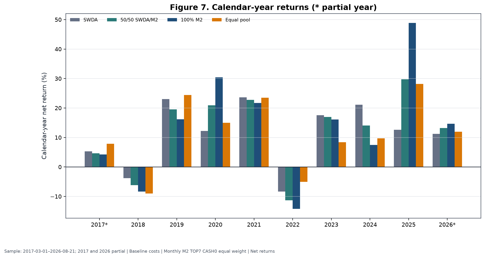

**Figure 7.** M2 materially exceeded SWDA in 2020 and 2025, lagged it in most ordinary years, and lost more in 2018 and 2022. Partial years are marked.

The evidence does not warrant retrospective stories for each fluctuation. Mechanically, 2018 showed that high-ranked families can fall more than global equities; 2019 showed a strong global and opportunity-pool year in which M2 lagged; 2020 delivered unusually strong M2 leadership; 2021 was broadly positive without active advantage; 2022 produced a deeper M2 loss; 2023 provided positive absolute returns but modest lag; 2024 was a large relative shortfall; 2025 was the dominant M2 year; and partial 2026 remained positive through the cutoff. The 10% wrapper improved the control materially mainly in 2020 and 2025 and detracted in six of the nine other reported full or partial calendar periods.

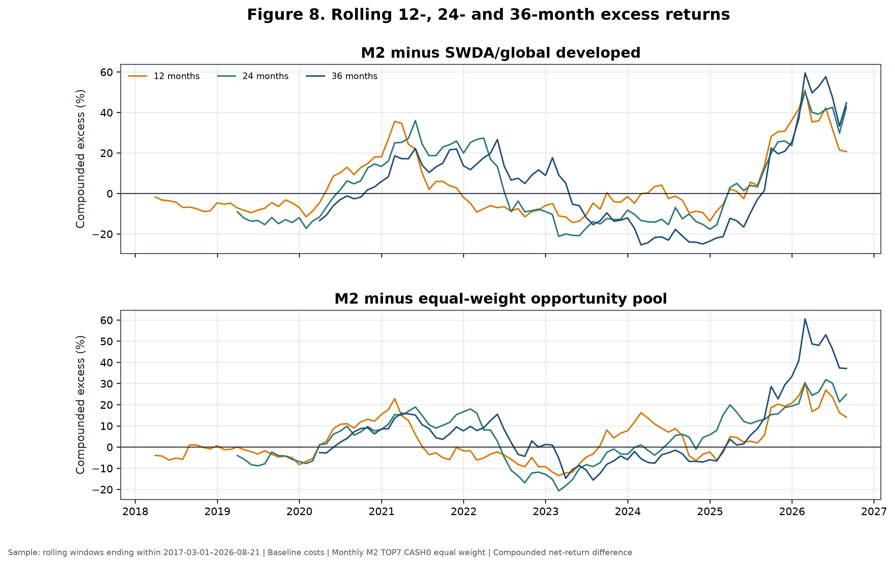

**Figure 8.** Rolling 12-, 24- and 36-month compounded excess versus SWDA and the equal pool. Long negative intervals coexist with the strong terminal observations. These are derived diagnostics from canonical paths and do not define a stop rule.

## 20. Regime analysis

A4F constructed causal telemetry using only information available at each monthly decision. The risk score had three components: global 126-session return above cash, global 252-session return above cash, and 63-session realised volatility relative to a prior expanding 75th-percentile threshold. Leadership strength required at least two of three components: a high top-seven leadership spread, rank persistence, and absolute leadership support. Combining risk and leadership produced four regimes.

**Table 13. Causal regime summary**

| Regime | Months | Episodes | Avg episode | M2 minus SWDA annualised | M2 excess vs pool | Sample status |
|---|---:|---:|---:|---:|---:|---|
| R1 broad risk-on | 7 | 6 | 1.17 mo | 3.82% | 0.52% | Insufficient |
| **R2 leadership risk-on** | **86** | **11** | **7.82 mo** | **1.80%** | **0.18%** | **Sufficient for description** |
| R3 isolated leadership | 16 | 8 | 2.00 mo | −1.63% | −0.34% | Insufficient |
| R4 capital preservation | 5 | 5 | 1.00 mo | 5.01% | 0.27% | Insufficient |

*Monthly decisions 2017-02-28–2026-07-31; performance through cutoff 2026-08-21; baseline cost convention. Internal sources [REG-R1_BROAD_RISK_ON]–[REG-R4_CAPITAL_PRESERVATION]: `UKACTIVE_A4F_SIPP_REGIME_SUMMARY.csv`, A4F commit `6dba072`.*

Only R2 had enough months and episode length for descriptive support. The seemingly favourable R1 and R4 point estimates rest on seven and five months respectively and cannot support allocation claims. Components also overlap economically: global trend, volatility and leadership can respond to the same shock. Counting them as independent confirmations would overstate information.

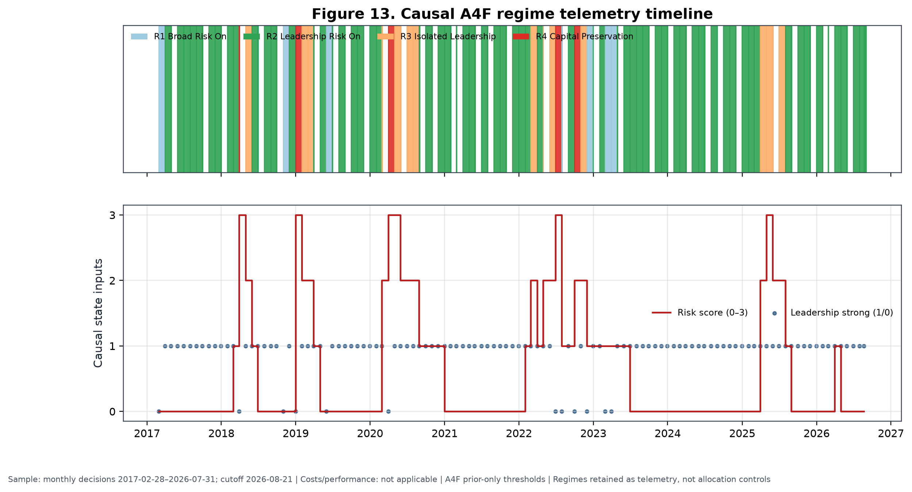

**Figure 13.** Monthly regimes, risk score and leadership state calculated with prior-only thresholds. Regimes are retained as telemetry, not allocation controls.

Five policy families were tested with immediate monthly switching and asymmetric hysteresis. P1 timed risk only, P2 timed M2 alpha only, P3 combined the two, P4 emphasised defence, and P5 was a higher-alpha diagnostic ineligible for selection. P0 was the static 75/25 control.

**Table 14. Dynamic policy results**

| Policy | Switch | Net CAGR | MDD | Ulcer | Avg cash | Return retention | Decision |
|---|---|---:|---:|---:|---:|---:|---|
| P0 static control | Either | 9.26% | −19.55% | 3.60% | 25.00% | 79.85% | Static control only |
| P1 risk timing | Immediate | 7.89% | −17.53% | 5.89% | 14.78% | 68.03% | Fail |
| P1 risk timing | Hysteresis | 7.33% | −17.53% | 5.82% | 18.04% | 63.16% | Fail |
| P2 alpha timing | Immediate | 11.66% | −24.50% | 5.28% | 0.00% | 100.50% | Fail gates |
| P2 alpha timing | Hysteresis | 11.71% | −24.50% | 5.19% | 0.00% | 100.95% | Fail gates |
| P3 balanced | Immediate | 8.03% | −16.88% | 6.17% | 14.78% | 69.23% | Fail |
| P3 balanced | Hysteresis | 7.39% | −16.88% | 6.05% | 18.04% | 63.72% | Fail |
| P4 defensive | Immediate | 6.75% | **−14.76%** | 6.83% | 19.70% | 58.19% | Fail |
| P4 defensive | Hysteresis | 5.91% | −17.29% | 7.50% | 24.05% | 50.96% | Fail |
| P5 diagnostic | Immediate | 8.26% | −16.32% | 6.78% | 14.78% | 71.22% | Ineligible/fail |
| P5 diagnostic | Hysteresis | 7.54% | −17.23% | 6.83% | 18.04% | 65.01% | Ineligible/fail |

*Common sample 2017-03-01–2026-08-21; baseline costs; monthly M2/SWDA/cash policies; net returns. Internal sources [POL-*]: `UKACTIVE_A4F_SIPP_DYNAMIC_POLICY_RESULTS.csv`, A4F commit `6dba072`; all mandatory gates were false.*

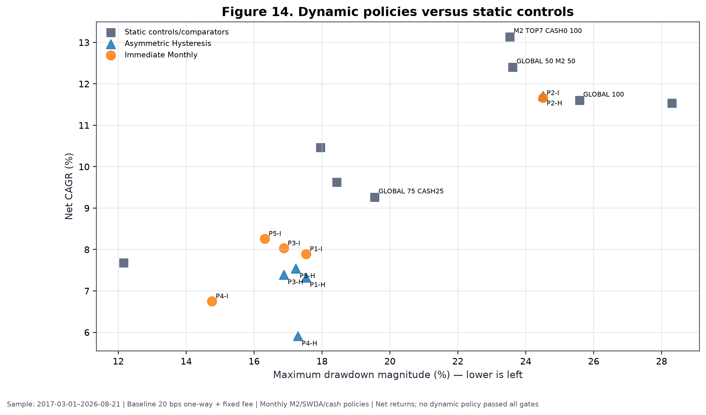

**Figure 14.** Immediate (`I`) and hysteresis (`H`) dynamic policies reduced some drawdowns only by surrendering substantial compounding or worsening path discomfort. Static comparators are shown separately.

The dynamic failures illuminate the difference between gradual and binary defence. Immediate switching could react faster but still acted after causal signals were observed; hysteresis reduced whipsaw at the cost of delayed re-risking. P4's immediate rule achieved the shallowest MDD but retained only 58.19% of the global-core return and had an Ulcer Index almost twice the static control's. P2 retained return but had a deeper MDD than the control and failed mandatory gates. Lagged exits and delayed re-entry damaged compounding; several policies had worse Ulcer even when MDD improved. Regime variables are retained as telemetry only and do not control the frozen allocation.

## 21. Randomisation and falsification evidence

Randomisation addressed a narrower question than conventional significance testing: holding the opportunity set, eligible count, cadence and broad portfolio mechanics fixed, did M2 select historically better families than a rule that discarded its ranking? Two A4F controls generated 10,000 paths each. The matched-count control chose seven families randomly from each contemporaneous eligible set. The rank-shuffle control permuted monthly ranks before selecting the top count. Both preserved the varying historical opportunity set.

**Table 15. Matched opportunity-set randomisation**

| Control | Paths | Candidate diagnostic CAGR | CAGR percentile | Candidate diagnostic MDD | Drawdown percentile | Candidate turnover |
|---|---:|---:|---:|---:|---:|---:|
| Random selection, same risky count | 10,000 | 12.60% | **99.36th** | −19.28% | **98.47th** | 5.53× |
| Monthly rank shuffle | 10,000 | 12.60% | **99.48th** | −19.28% | **98.30th** | 5.53× |

*Diagnostic executions 2017-03-01–2026-08-03; 20 bps one-way plus £3.99 per paid leg on £250,000; monthly TOP7 CASH0 eligibility; vectorised net diagnostic. Internal sources [RAND-RANDOM_SELECTION_SAME_RISKY_COUNT] and [RAND-MONTHLY_RANK_SHUFFLE]: `UKACTIVE_A4F_SIPP_RANDOM_SELECTION_CONTROL.csv`, A4F commit `6dba072`.*

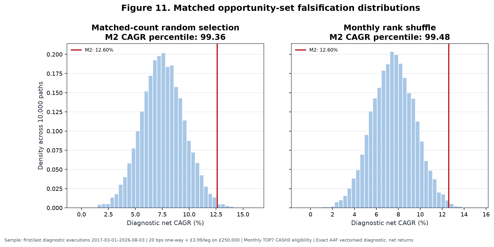

**Figure 11.** Exact deterministic reproduction of the two 10,000-path CAGR distributions. The displayed 12.60% diagnostic CAGR is not the 13.14% primary scientific CAGR because the randomisation engine uses its own vectorised execution endpoints and fee implementation. The evidence matrix preserves that metric distinction.

The correct interpretation is: **the ranking selected better historical outcomes than random choice from the same opportunity set.** The experiment directly challenges the hypothesis that any arbitrary seven thematic families would have produced the result. It does not prove stable alpha, an unbiased expected premium, independent replication or distributed return support. Random paths can be decisively worse even when the winning candidate's advantage is concentrated in a few episodes. That is exactly why randomisation must be read together with year, family and spell influence.

## 22. Right-tail dependence and contribution analysis

### 22.1 Family and rank attribution

Gross market-P&L attribution assigns the largest family shares to global battery/EV (15.82%), global semiconductors (14.91%), global silver miners (13.84%), global gold miners (10.98%) and European banks (9.37%). The top three together contributed 44.57% and the top five 64.92%. Because negative families subtract from the denominator, contributor shares can sum to more than 100%; they are explanatory arithmetic shares, not CAGRs.

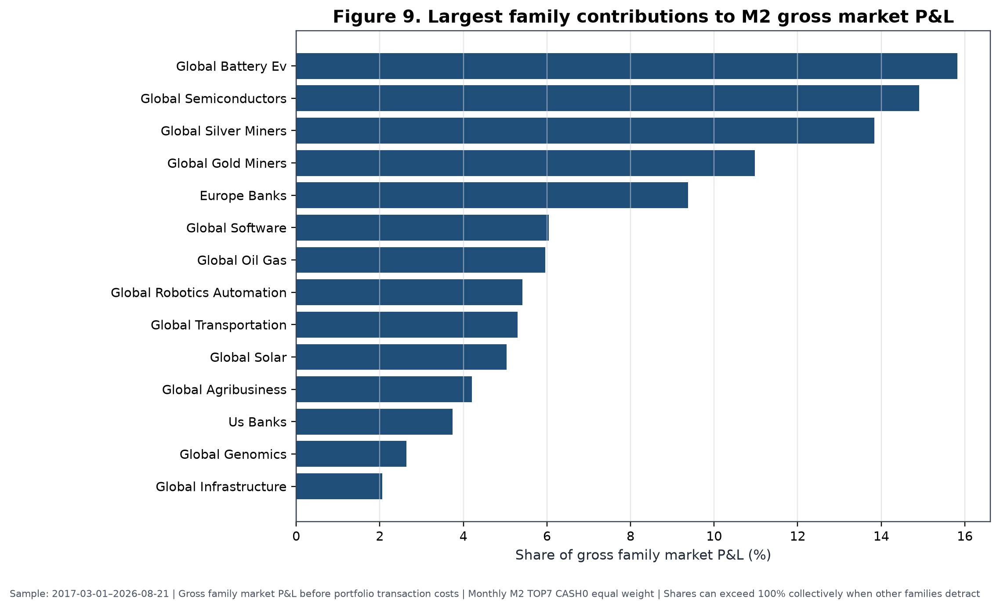

**Figure 9.** Largest gross family market-P&L shares, 2017-03-01–2026-08-21. The chart precedes portfolio transaction costs and ranks contributors ex post; it is not a selection rule.

Rank attribution is less concentrated at the very top than the earlier TOP1 work implied. Rank 1 contributed 19.98%; ranks 2–3, 17.24%; ranks 4–5, 37.28%; and ranks 6–10, 26.50%, with −1.00% unattributed to the currently selected-rank buckets. Thus a large part of historical P&L came from the middle and lower portion of the selected basket. This supports breadth, but does not remove family concentration.

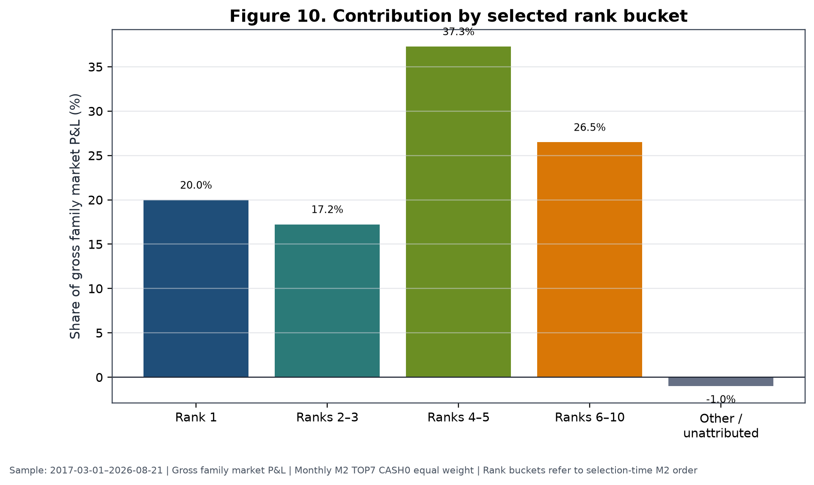

**Figure 10.** Gross contribution by selection-time M2 rank bucket. Ranks 6–10 include positions held through monthly transitions under the canonical attribution convention.

*Internal sources [CONTRIB-FAM-01]–[CONTRIB-FAM-12] and [CONTRIB-RANK-*]: A4D contribution CSVs, commit `f411e0d`.*

### 22.2 Holding spells

The largest completed spell was global silver miners from 2025-03-03 to 2026-05-01, with a 146.30% held return and 14.97% normalised arithmetic contribution. Battery/EV from 2019-11-01 to 2021-09-01 returned 109.44% while held and contributed 11.60%. Global semiconductors from 2023-02-01 to 2024-09-02 contributed 9.28% with a 78.42% held return. A later battery/EV spell beginning 2025-08-01 contributed 9.07%; global oil and gas from 2021-10-01 to 2023-02-01 contributed 7.69%; and European banks from 2025-02-03 to 2025-10-01 contributed 7.08%.

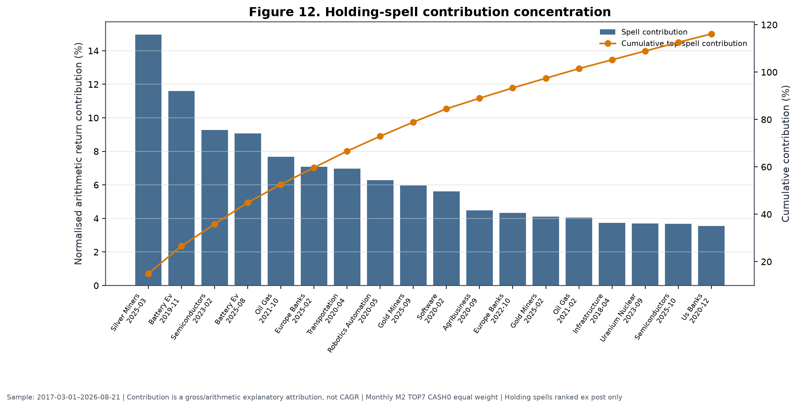

**Figure 12.** Positive holding spells ranked ex post. Cumulative contribution exceeding 100% means other spells detracted. The display measures influence; it does not justify deleting or harvesting a live winner.

### 22.3 Influence tests

**Table 16. Family and holding-spell influence**

| Test | Recomputed net CAGR | Incremental CAGR vs SWDA | Interpretation |
|---|---:|---:|---|
| Minimum leave-one-family-out | — | **0.09 pp** | No single family reverses full result |
| Exclude top one family | — | 0.25 pp | Material weakening, still positive |
| Exclude top three families | — | **−4.37 pp** | Reverses |
| Exclude top five families | — | **−5.07 pp** | Reverses |
| Delete largest holding spell | 11.60% | **−0.00 pp** | Essentially removes active advantage |
| Delete three largest spells | 9.47% | **−2.13 pp** | Reverses |
| Delete five largest spells | 7.77% | **−3.84 pp** | Reverses strongly |

*Sample: 2017-03-01–2026-08-21; monthly M2 TOP7 CASH0 equal weight; baseline costs; ex-post counterfactuals. Dashes indicate that the concise source record emphasises incremental result; complete values are in the supplement. Internal sources [INFL-01]–[INFL-07]: A4F family and holding-spell influence CSVs, commit `6dba072`.*

The apparent tension is real. The leave-one-family-out minimum remains positive, showing that no single family alone is the entire strategy. Yet removing the leading group or just the largest spell reverses the incremental result. M2 is therefore best interpreted as a **right-tail trend-capture process with historical ranking information and episodic portfolio-level alpha**. Reliance on large trends is not automatically a defect: trend-following processes are designed to accept many ordinary or losing positions in exchange for participation in rare persistent moves. The scientific concern is estimation reliability. With only a few such moves, their frequency and future magnitude are weakly determined.

## 23. Statistical uncertainty

Signal-level HAC tests accounted for overlapping horizons and serial dependence, and the multiple-testing ledgers applied false-discovery adjustment. Neither the A3 broad search nor the A4D signal-inference family produced an adjusted q-value at or below 0.10. Economic point estimates were then assessed with a six-month circular block bootstrap on the latest five years: 59 monthly observations and 5,000 resampled paths.

**Table 17. Statistical uncertainty**

| Comparator | Estimand | Observed | 95% interval | Probability positive | Design | Conclusion |
|---|---|---:|---:|---:|---|---|
| SWDA/global developed | Arithmetic annualised monthly M2-minus-benchmark return | 1.88% | −9.04% to 16.20% | 59.86% | 59 months; circular 6-month blocks; 5,000 paths | Interval includes zero |
| Equal-weight pool | Same estimand | 2.94% | −5.61% to 12.73% | 73.80% | Same | Interval includes zero |

*Sample: 2021-09-01–2026-08-21; baseline-cost monthly M2 TOP7 CASH0 equal weight. Internal sources [UNC-01], [UNC-02]: `UKACTIVE_A4D_REPRESENTATIVE_BLOCK_BOOTSTRAP.csv`, A4D commit `f411e0d`.*

No Superior Predictive Ability test was completed for the frozen model, so no SPA result is claimed. The White and Hansen literature motivated the research discipline; it is not a substitute for an unperformed test. The block bootstrap also cannot manufacture regimes absent from the data. Nine and a half executable years contain roughly 114 monthly decisions but far fewer independent multi-month market episodes. The 59-month bootstrap window contains still fewer.

Intervals including zero do not prove the absence of an effect. They show that the completed sample and dependence-aware design cannot estimate its sign precisely at conventional confidence. Conversely, high randomisation percentiles do not make these intervals irrelevant. Randomisation says the realised ordering beat scrambled ordering; the bootstrap says the magnitude of recurring excess is uncertain. Both can be true when the realised advantage sits in a small right tail.

## 24. Robustness and influence tests

Robustness was assessed by time split, recent windows, year deletion, costs, family deletion, spell deletion and matched-risk controls. A result is labelled **preserves** when the incremental estimate remains positive without a material change in interpretation, **materially weakens** when it remains marginally positive or loses economic margin, and **reverses** when it becomes non-positive. These are descriptive classifications, not formal hypothesis tests.

**Table 18. Full-history robustness summary**

| Test | M2 net CAGR | Incremental vs SWDA | MDD | Assessment |
|---|---:|---:|---:|---|
| Full common history | 13.14% | 1.54 pp | −23.53% | Preserves |
| Pre-2020 | 3.76% | **−4.32 pp** | −13.91% | Reverses |
| Post-2020 | 17.25% | 4.29 pp | −23.53% | Preserves |
| Latest five years | 13.62% | 2.10 pp | −22.34% | Preserves |
| Latest three years | 29.51% | 10.83 pp | −16.72% | Preserves, very period-specific |
| Exclude 2025 | 10.42% | **−1.03 pp** | −23.53% | Reverses |
| Exclude 2020 | 12.11% | 0.61 pp | −22.34% | Preserves narrowly |
| Exclude 2020 and 2025 | 7.58% | **−3.78 pp** | −22.34% | Reverses |
| Doubled costs | 11.80% | **0.20 pp** | −23.73% | Materially weakens |
| Minimum leave-one-family-out | — | 0.09 pp | — | Materially weakens, does not reverse |
| Exclude top three families | — | −4.37 pp | — | Reverses |
| Delete top three spells | 9.47% | −2.13 pp | — | Reverses |

*Common and split samples end 2026-08-21; year exclusions are non-contiguous diagnostics; baseline costs except doubled-cost row. Internal sources [ROB-01]–[ROB-10] and [INFL-01]–[INFL-07]: A4D economic scorecard and A4F exclusion/influence results at commits `f411e0d` and `6dba072`.*

The disproportionate role of 2020 and 2025 is not an artefact of a single year-label choice: the calendar table, rolling excess, family contributions and spell deletions all point to episodic leadership. Excluding 2025 alone reverses M2's SWDA difference. Excluding 2020 alone leaves only 0.61 pp. Excluding both produces a −3.78 pp difference. Pre-2020 evidence is adverse. Post-2020, latest-five-year and latest-three-year evidence is favourable but increasingly dominated by the same right tail.

Doubled one-way friction reduces full M2 CAGR from 13.14% to 11.80%, leaving only about 0.20 pp above SWDA and 0.27 pp above the equal pool under the corresponding canonical comparisons. Cost sensitivity therefore affects confidence and sizing, even though baseline monthly economics remained positive. Matched-risk and matched-exposure controls further show that some apparent defensive benefits can be replicated by static lower exposure.

## 25. Why the strategy was selected and frozen

The selection decision must be read as a constrained synthesis of favourable and adverse evidence. M2 was frozen because it was the most defensible completed specification, not because every test supported it.

First, M2 captured stronger historical ranking information than the equal-horizon M1 control: it passed the predeclared diagnostic gate at two top-quintile horizons, improved full and recent portfolio economics, and reduced turnover. M3 passed the same diagnostic count but its deterioration penalty reduced return without improving drawdown. Second, the TOP6–TOP9 frontier was coherent enough to support a moderately diversified basket. TOP7 represented that region without choosing TOP6's full-history or TOP8's recent maximum.

Third, monthly implementation survived costs better than daily and weekly alternatives. It gave up gross responsiveness in exchange for materially fewer legs, lower drag and positive doubled-cost pool excess. Fourth, equal weighting avoided turning noisy rank differences into large capital differences. Rank-decay and fixed top-heavy schemes had lower return, deeper drawdown and higher turnover.

Fifth, the ranking materially beat matched-count random selection and monthly rank shuffling. Sixth, no single family exclusion reversed the full result, and rank-bucket attribution showed that returns did not come only from rank one. Seventh, the model participated in several distinct major trends—battery/EV, semiconductors, silver miners, gold miners, oil and gas, and European banks—rather than one asset alone.

The adverse half of the decision is equally central. Signal inference did not survive broad false-discovery adjustment. The portfolio advantage disappeared before 2020, after deleting 2025, after deleting the largest spell, and after removing small groups of leading families or spells. Baseline costs consumed 1.34 pp of standalone CAGR, and doubled costs nearly erased the SWDA margin. M2 had a worse Ulcer Index, higher volatility and a longer underwater period than SWDA. No untouched holdout or independent E3 confirmation exists.

No cash, exit or regime overlay improved full-history economics enough to be admitted. CASH1's favourable recent drawdown failed on the complete history and against static matched exposure. Dynamic regimes reduced some drawdowns but damaged compounding or Ulcer. Adding more signal rules after observing these failures would increase data-snooping exposure. The rational research action was therefore to stop.

M2 was not allocated at 50% or 100% live because those weights would make retirement outcomes depend heavily on an episodic and weakly estimated right tail. The 50/50 blend is a research comparator; its full CAGR was 12.40%, but it still had a −23.62% MDD, 5.89% Ulcer and 763-day underwater period. The 10% sleeve permits participation in rare leadership without making the whole SIPP an M2 portfolio. Its small expected effect is a feature of risk budgeting, not evidence that the strategy is unimportant.

## 26. Exact frozen strategy

**Table 19. Definitive frozen-strategy specification**

| Field | Frozen value |
|---|---|
| Strategy ID | `INDUSTRY_PLUS_THEME | M2_BASE | TOP7 | MONTHLY | CASH0_ALWAYS_INVESTED | EQUAL` |
| Research unit | Economic-exposure family, not ticker |
| Structural universe | 27 frozen industry/theme families |
| Eligibility | Complete causal 21/42/63/126/252-session inputs; at least three eligible families |
| Benchmark | `GLOBAL_DEVELOPED_WORLD`; SWDA in current implementation |
| Relative return | `(1 + family cumulative total return) / (1 + benchmark cumulative total return) − 1` |
| Rank method | Cross-sectional average-tie percentile among eligible families |
| Signal weights | 0.10, 0.15, 0.25, 0.30, 0.20 on 21, 42, 63, 126, 252 sessions |
| Sort | M2 descending; exact ties by family ID ascending |
| Breadth | TOP7; fewer only if 3–6 eligible under frozen rule |
| Weighting | Equal across selected families |
| Signal date | Final valid XLON session of month |
| Execution date | First following valid XLON session, within three sessions |
| Historical costs | 20 bps one-way plus applicable fixed dealing fee; doubled-cost stress at 40 bps |
| Cash treatment | CASH0: selected available slots invested; unavailable/suspended live slot to CSH2 |
| Instrument rule | Preferred GBP/GBX line; only frozen approved alternate after current confirmation |
| Leverage / shorting | None / none |
| Discretionary overrides | Prohibited |
| Model-development status | `M2_HISTORICAL_MODEL_DEVELOPMENT_CLOSED` |

*Internal sources [M2-FROZEN], [M2-FORMULA], [M2-TIMING], [COST-HIST] and [LIVE-MAP]: A5C frozen spec at freeze commit `a8008f7` and A5C live map at results commit `beb8d49`.*

Reproducible monthly pseudocode is:

```text
input: immutable family map, accepted total-return histories, SWDA benchmark,
       XLON sessions, prior holdings, frozen instrument map

t = final valid XLON session of review month
u = first valid XLON session after t; require u no later than third valid session

for each structural family i:
    require an accepted point-in-time history through t
    for h in [21, 42, 63, 126, 252]:
        require family and benchmark endpoints on the frozen true-session contract
        raw_rs[i,h] = (1 + family_total_return[i,t,h]) /
                      (1 + benchmark_total_return[t,h]) - 1

eligible = families with all five raw_rs values
if count(eligible) < 3: suspend run

for h in [21, 42, 63, 126, 252]:
    rs_percentile[:,h] = average_tie_percentile(raw_rs[eligible,h])

m2[i] = 0.10*rs_percentile[i,21]
      + 0.15*rs_percentile[i,42]
      + 0.25*rs_percentile[i,63]
      + 0.30*rs_percentile[i,126]
      + 0.20*rs_percentile[i,252]

rank eligible by (-m2, family_id)
selected = first min(7, count(eligible)) families
family_target = 1 / count(selected) within M2 sleeve

for each selected family:
    map to frozen preferred current GBP/GBX line
    if unavailable or suspended: assign that slot to CSH2
    else: retain mapped ETF target

compare targets with holdings; create deterministic legs
execute on u at market-price operating convention
record signal inputs, ranks, mappings, fills, fees, friction and exceptions
make no intra-month discretionary changes
```

The pseudocode specifies the decision, not broker instructions. A run cannot be reconstructed by reading the M2 label alone; the exact percentile, tie, missing-data and timing contracts are integral.

## 27. Detailed frozen-strategy statistics

### 27.1 Standalone active strategy

At the A4D scientific baseline notional of £250,000, M2's full-history net CAGR was 13.14%, recent-five-year CAGR 13.62%, full MDD −23.53%, Ulcer 8.20%, Calmar 0.56, volatility 18.49%, longest underwater period 857 days, turnover 5.52×, 865 trade legs and terminal wealth £321,979 per £100,000. Its full-window CAGR differences were +1.54 pp versus SWDA and +1.61 pp versus the equal pool. On the latest five years, M2's MDD was −22.34%, Ulcer 10.13%, volatility 19.70%, turnover 6.93× and terminal wealth £188,614; CAGR differences were +2.10 pp versus SWDA and +2.63 pp versus the pool. (Internal sources [ECON-M2_TOP7_CASH0_100] and [BR-7], A4D/A4F canonical scorecards.)

A5C restated the same strategy for a £563,000 II Plus illustration. Fixed fees are smaller relative to this notional, so the subscription-separated net CAGR is 13.20% full history and 13.68% latest five years rather than the £250,000 A4D values. The gross CAGRs are 14.48% and 15.30%; full-subscription values are 13.18% and 13.66%. The change is a notional/fee treatment, not a new model or sample conclusion. Full-history current-scale annual market friction was estimated at £6,218.97 and annual all-in cost at £6,721.48; these are scale illustrations, not forecasts of actual fills. (Internal sources [WRAP-M2_100_DIAGNOSTIC-FULL_HISTORY-563000] and [WRAP-M2_100_DIAGNOSTIC-LATEST_FIVE_YEARS-563000]: A5C cost restatement, results commit `beb8d49`.)

### 27.2 Whole-SIPP pilot and research comparators

**Table 20. 0%, 10%, 15% and 25% M2 whole-SIPP comparison, II Plus, £563,000**

| Window | M2 weight / status | Gross CAGR | Net CAGR, subscription separate | Net CAGR, subscription included | Increment vs 75/25 control | MDD | Ulcer | Turnover | Current annual market friction | Current annual all-in cost |
|---|---|---:|---:|---:|---:|---:|---:|---:|---:|---:|
| Full | 0% control | 9.29% | 9.28% | 9.25% | 0.00 pp | −19.55% | 3.60% | 0.14× | £159.05 | £338.93 |
| Full | **10% pilot** | 9.61% | **9.42%** | 9.40% | **0.14 pp** | −19.11% | **3.58%** | 0.68× | £769.97 | £1,355.46 |
| Full | 15% comparator | 9.77% | 9.52% | 9.50% | 0.24 pp | −18.88% | 3.65% | 0.96× | £1,077.44 | £1,662.92 |
| Full | 25% comparator | 10.08% | 9.71% | 9.69% | 0.43 pp | **−18.43%** | 3.86% | 1.50× | £1,691.80 | £2,277.29 |
| Latest 5y | 0% control | 9.58% | 9.57% | 9.55% | 0.00 pp | −13.90% | **3.35%** | 0.06× | £64.84 | £244.72 |
| Latest 5y | **10% pilot** | 10.01% | **9.80%** | 9.78% | **0.23 pp** | −13.51% | 3.51% | 0.75× | £846.76 | £1,457.81 |
| Latest 5y | 15% comparator | 10.22% | 9.94% | 9.91% | 0.37 pp | −13.38% | 3.68% | 1.10× | £1,239.69 | £1,850.75 |
| Latest 5y | 25% comparator | 10.64% | 10.20% | 10.17% | 0.63 pp | **−13.15%** | 4.11% | 1.80× | £2,024.76 | £2,635.82 |

*Full sample 2017-03-01–2026-08-21; latest five years 2021-09-01–2026-08-21. Wrapper always retains 25% defensive; M2 replaces SWDA as its weight rises. 20 bps one-way, II Plus credits/fees, £563,000. Internal sources [WRAP-*563000]: `UKACTIVE_A5C_SIPP_COST_RESTATEMENT.csv`, results commit `beb8d49`.*

The 10% pilot generated 1,076 historical trade legs on the full window, £3,842.37 in paid dealing charges, £10,855.35 in market friction and £1,708.86 in account subscription. Those cumulative pound values are not annual costs. On the latest-five-year window the corresponding legs were 597, dealing charges £2,142.63, market friction £7,401.07 and subscription £899.40. Subscription-separated performance is the primary incremental view because the control account also needs a broker plan; the all-in view is shown to avoid hiding the expense.

The 15% and 25% rows are research comparators, not authorised allocations. Their higher historical incremental CAGR came with higher turnover, cost and latest-five-year Ulcer. A monotonic historical return increment is not a sizing rule when the standalone edge is uncertain. Figure 15 displays the return-drawdown locations without treating the upper point as a recommendation.

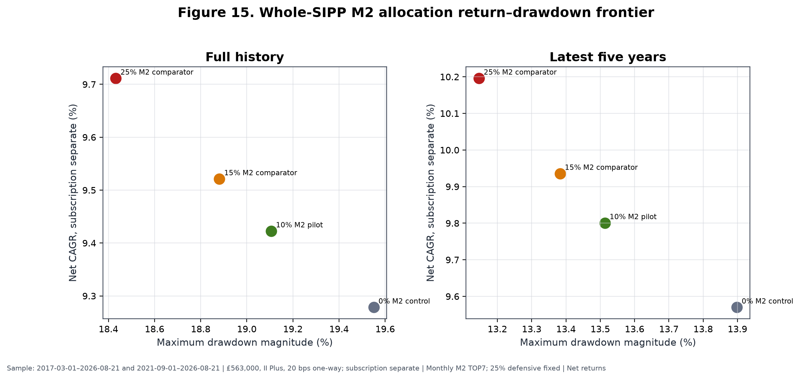

**Figure 15.** Full and latest-five-year II Plus results at £563,000, subscription reported separately. The green 10% point is the conditional pilot; orange and red points are research comparators only.

## 28. Live instrument implementation

M2 ranks economic families and only then maps them to trading lines. Table 21 records the frozen preferred GBP lines and current alternates. An alternate is not automatically authorised: the A5C map requires current SIPP confirmation, and USD/EUR alternates are blocked where the rule says `NO_USD_OR_EUR_LINE`. The table is current implementation evidence at the cutoff and is expressly prohibited from historical back-projection.

**Table 21. Concise current implementation map**

| Economic family | Preferred | ISIN | Frozen alternate | Trading currency | Cutoff signal status |
|---|---|---|---|---|---|
| Global developed world core | SWDA | IE00B4L5Y983 | IWDA | GBP | Core / not ranked |
| China internet | KWBP | IE00BMW13836 | KWBH | GBP | Ready |
| Europe aerospace & defence | DFEU | IE000IAXNM41 | EDEG | GBP | Ready |
| Europe banks | S7XP | IE00B3Q19T94 | CB5 | GBP | Ready |
| Europe infrastructure | BLDR | IE000PTMIE90 | FTIE | GBP | RS252 warm-up |
| Global aerospace & defence | ICBM | IE000NVDQXE1 | MISL | GBP | Ready |
| Global agribusiness | SPAG | IE00B6R52143 | ISAG | GBP | Ready |
| Global AI | AIAA | IE000Q9W2IR3 | IAIX | GBP | Ready |
| Global battery/EV | CHRG | IE00BKLF1R75 | VOLT | GBP | Ready |
| Global biotechnology | SBIX | IE00BQ70R696 | SBIO | GBP | Ready |
| Global clean energy | INRA | IE000U58J0M1 | GCEX | GBP | Ready |
| Global cybersecurity | CYSE | IE00BLPK3577 | WCBR | GBP | Ready |
| Global genomics | ARCG | IE000O5M6XO1 | ARKG | GBP | Ready |
| Global gold miners | SPGP | IE00B6R52036 | IAUP | GBP | Ready |
| Global infrastructure | INFR | IE00B1FZS467 | IDIN | GBP | Ready |
| Global oil & gas | SPOG | IE00B6R51Z18 | IOGP | GBP | Ready |
| Global quantum computing | QANT | IE000C6ITGC8 | QNTG | GBP | Ready |
| Global retail | EBIG | IE00BMH5XY61 | EBIZ | GBP | Ready |
| Global robotics & automation | RBTX | IE00BYZK4552 | RBOT | GBP | Ready |
| Global semiconductors | SMGB | IE00BMC38736 | SMH | GBP | Ready |
| Global silver miners | SILG | IE000UL6CLP7 | SILV | GBP | Ready |
| Global software | KLWD | IE00BJGWQN72 | WCLD | GBP | Ready |
| Global solar | RAYS | IE00BM8QRZ79 | ISUN | GBP | Ready |
| Global transportation | ECOG | IE00BF0M6N54 | ECOM | GBP | Ready |
| Global uranium & nuclear | NUCG | IE000M7V94E1 | NUCL | GBP | Ready |
| Global water | IH2O | IE00B1TXK627 | DH2O | GBP | Ready |
| US aerospace & defence | SEAL | IE000KDY10O3 | GIJO | GBP | All-horizon warm-up |
| US banks | XUFB | IE00BDVPTJ63 | BNKS | GBP | Ready |

*Current-only map at 2026-08-21. Internal source [LIVE-MAP]: A5C `UKACTIVE_A5C_SIPP_LIVE_INSTRUMENT_MAP_V2.csv`, results commit `beb8d49828b9819aa167d2e07ffdc2b92581b36b`, all 31 role rows; the supplement includes fund names, alternate ISINs, hedging status and permission flags.*

Preferred GBP/GBX execution avoids a broker FX conversion fee, but most equity lines are unhedged. Their underlying companies, indices and fund NAVs retain currency exposure. Same-ISIN USD alternates such as IWDA, MISL, ISAG and VOLT are recorded for identity and control but are not permissible automatic substitutes under the frozen GBP-only operating rule. A same-currency alternate may be considered only where the map explicitly permits it and current SIPP availability has been confirmed.

If a selected preferred line and its permitted frozen alternate are unavailable or suspended, the family remains selected scientifically but its capital slot goes to CSH2 operationally. The next-ranked family is not promoted. That rule preserves the ranking decision and makes implementation failure visible instead of disguising it as a new model choice.

## 29. Defensive implementation

The 25% defensive allocation has three distinct implementation roles.

**RLON** is the strategic defensive holding label. The final A5C repository did not establish its exact current share class, ISIN and dealing terms. The canonical row therefore says `AWAITING_EXACT_CURRENT_HOLDING_SHARE_CLASS` and the project remains blocked on a dated holdings export. This paper does not infer an identity from the user label.

**CSH2**, Amundi Smart Overnight Return GBP Hedged (`LU1230136894`), is the frozen tactical liquidity instrument. It receives unavailable or suspended M2 slots and can hold affected sleeve capital while a data, execution or cost breach is resolved. Current SIPP permission still requires confirmation.

**Broker cash** is reserved for settlement, charges and small residual balances. It is not the strategic 25% defensive asset and is not the historical research cash series.

RLON and CSH2 are not assumed to earn 4% permanently. Their returns depend on short-term interest rates, fees, tracking and instrument structure. Current positive cash yields can reduce the opportunity cost of operational waiting, but yields will fall if policy and money-market rates decline. Historical strategy tests used the accepted time-varying SONIA-based proxy rather than the current observed yield of either product.

## 30. How the strategy should be used

The intended use is a disciplined monthly process, not continuous discretionary trading. Before any first run, the account must be operationally ready: a dated exact holdings export, verified RLON identity, current Interactive Investor plan, and current SIPP confirmation for CSH2 and selected ETF lines are required. After readiness and explicit user approval, the monthly sequence is:

1. validate the frozen code and configuration hashes, source prices, total-return fields, GBP cash data, XLON calendar, universe and append-only ledger;
2. determine point-in-time eligible families without forcing warm-up members into the signal;
3. calculate 21-, 42-, 63-, 126- and 252-session benchmark-relative returns through the final valid month-end close;
4. convert each horizon to the eligible cross-sectional percentile and compute M2 with frozen weights;
5. rank economic families with average-tie and family-ID rules;
6. select TOP7 and assign equal M2-sleeve weights;
7. map each selected family to its preferred confirmed GBP/GBX instrument or permitted frozen alternate;
8. calculate whole-SIPP targets at 65% SWDA, 10% M2 and 25% defensive;
9. compare targets with actual holdings and recognise any existing thematic exposure;
10. ensure aggregate active/thematic exposure will remain at or below 25%;
11. resolve the first valid following XLON execution session within the three-session window;
12. prepare a review-only trade list using market-price execution and 20 bps expected one-way friction;
13. allocate any unavailable or suspended slot to CSH2;
14. obtain explicit approval, execute manually, and record fills, dealing fees, spread/shortfall and deviations; and
15. make no discretionary intra-month change.

*Internal sources [PILOT-ALLOCATION] and [PILOT-CAP]: A5C frozen spec, freeze commit `a8008f7`; A5C `UKACTIVE_A5C_SIPP_MONTHLY_RUNBOOK.md`, results commit `beb8d49`.*

At a 10% M2 sleeve, each of seven equal families is approximately 1.43% of the whole SIPP. This limits any one theme's target impact but does not eliminate overlap with SWDA or the defensive book. Existing thematic funds must be replaced by, or absorbed within, the M2 budget; the sleeve is not automatically added on top of them. The 25% aggregate active/thematic cap is a governance ceiling, not a target.

The operating assumption is deliberately conservative: use market-price execution in planning, not midpoint fills. Actual implementation shortfall may be better or worse and must be measured. No code in A5C can transmit orders. The supplement provides a complete checklist, ledger fields and exception path.

## 31. Performance expectations and relative underperformance

M2 should not be expected to beat SWDA every calendar year. The historical process accepted routine underperformance while seeking participation in episodic, persistent leadership. In seven of the ten full or partial calendar rows, M2 did not beat SWDA. At 10% whole-SIPP weight, the corresponding drag was smaller, but it remained negative in 2017, 2018, 2019, 2021, 2022, 2023 and 2024.

Relative-regret diagnostics quantify the tolerance demanded by such a process. Standalone M2's maximum relative drawdown versus SWDA was −26.78%, and the longest relative-underperformance span was 1,595 calendar days. Against the 75/25 control, the 10% pilot's maximum relative drawdown was −3.10% with the same 1,595-day duration. The 15% and 25% comparators reached −4.54% and −7.37%, with longest spans of 1,595 and 1,594 days. (Internal source: A5C `UKACTIVE_A5C_SIPP_RELATIVE_REGRET.csv`, results commit `beb8d49`, `MAXIMUM_RELATIVE_DRAWDOWN` and `LONGEST_RELATIVE_UNDERPERFORMANCE_DAYS` rows.)

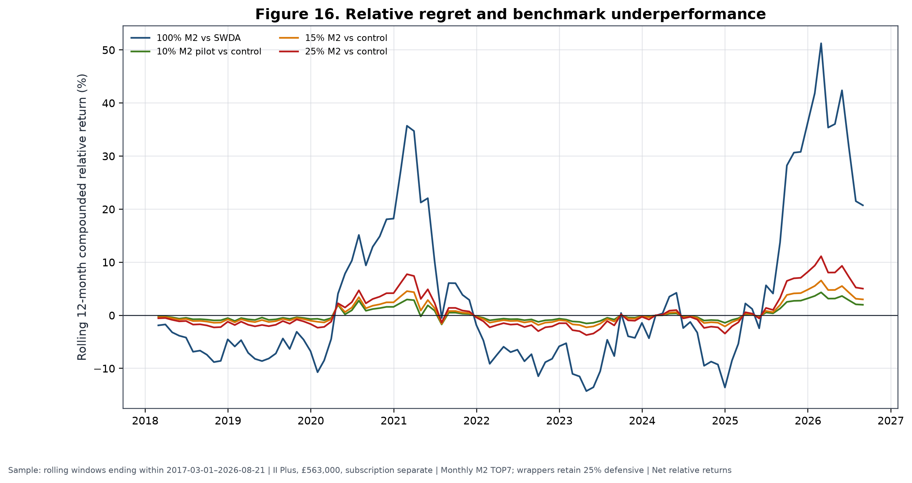

**Figure 16.** Rolling 12-month compounded relative returns for standalone M2 versus SWDA and 10%/15%/25% wrappers versus the 75/25 control. Wrapper lines retain a fixed 25% defensive allocation and use II Plus £563,000 subscription-separated results.

At 10%, a −10% standalone relative period contributes roughly −1% before interaction and cost to whole-SIPP relative performance; the separately simulated wrapper, rather than linear attribution, remains authoritative. At 15% and 25%, both upside participation and regret scale. A small or temporary benchmark lag can be economically tolerable if the sleeve retains its bounded role and the operating contract remains intact. It cannot be reclassified as a defect merely because SWDA wins a year.

No performance stop was estimated from the historical sample. Creating one now would reuse the same exposed path, risk cutting off the right tail, and contradict the failed deterioration/exit tests. Performance is monitored as evidence, not as an automatic allocation switch.

## 32. Suspension and governance

Suspension is triggered by process integrity, not ordinary returns:

- **Data-validation failure:** if price, total-return, cash, universe, calendar or hash validation fails, create no decision, do not backfill and retain affected capital in CSH2.
- **Rank reproducibility failure:** if a second frozen run cannot reproduce the same eligible set, scores and order, suspend M2 and hold the sleeve in CSH2.
- **Instrument unavailability:** if neither the preferred line nor a permitted frozen GBP/GBX alternate is available, place only that slot in CSH2.
- **Execution-window failure:** if execution cannot occur within three valid XLON sessions, do not chase the market; use CSH2.
- **Cost breach:** if quoted or actual one-way friction exceeds 40 bps, suspend that instrument change and review implementation.
- **Historical defect:** if a material causal, return, mapping or cost defect is discovered in a canonical input or frozen implementation, stop prospective use and reopen scientific review under a new immutable lineage.
- **No performance-only stop:** short-term or calendar-year underperformance alone is not a model defect.

The cost threshold is an operational suspension rule, not permission to redefine the historical cost assumption. A suspended slot remains visible in the ledger, including reason, dates and eventual resolution. Governance forbids discretionary substitution, intra-month exits, leverage, shorting, performance-chasing and silent alteration of the family taxonomy.

Research should reopen if the frozen implementation cannot be reproduced; if a material historical defect changes the evidence grade or selected specification; if structural changes make a substantial part of the universe unimplementable; if actual friction persistently violates the operating envelope; or if accumulated prospective evidence shows the ranking no longer behaves differently from its controls. Reopening means a new preregistered research stage, not an ad hoc live override.

## 33. Prospective evidence plan

At freeze, the prospective ledger contained its header and zero data rows. The earliest expected post-freeze signal was the first valid month-end after the freeze, identified by the A5C runbook as 2026-08-28; no observation before freeze may be relabelled prospective. The historical conclusion is fixed at the 2026-08-21 cutoff. (Internal source [A5C-LEDGER]: A5C prospective ledger at freeze commit `a8008f7`; runbook at results commit `beb8d49`.)

Each prospective month should record the data hash, calendar hash, eligible denominator, five component ranks, composite score, TOP7, preferred/alternate mapping, target and actual weights, execution session, intended and realised prices, dealing fees, implementation shortfall, CSH2 substitutions, regime telemetry, approval and exception status. Parallel controls should include the contemporaneous equal-weight opportunity pool, SWDA, matched-count random selection or an immutable random-control protocol, and the 75/25 whole-SIPP control. Leadership episodes should be reviewed prospectively by participation, duration, rank stability and realised contribution without creating new exits.

Evidence for considering 15% or 25% should not be reduced to elapsed time or positive P&L. There is no fixed requirement to wait exactly 24–36 months, and there is no automatic escalation after a profitable year. A sizing review should require operational stability; sufficiently varied prospective market and leadership episodes; costs within the frozen envelope; persistent ranking advantage versus contemporaneous controls; contributor support not confined to one accidental winner; and a whole-SIPP risk budget that remains acceptable. Because these criteria require judgement, any increase also requires explicit user approval and a documented governance decision.

Abandonment should be considered if a historical defect invalidates the causal chain, repeated prospective rank failures resemble random controls, implementation costs consume the expected margin, instrument availability makes the family process unrepresentative, or the right-tail mechanism fails across enough independent leadership opportunities to make the original interpretation untenable. A few losing months or one lagging year are insufficient on their own.

Prospective evidence is required to advance beyond `E2_DEVELOPMENTAL`. A5C passed 26 of 26 correctness checks, but correctness means the code and artefacts satisfy their frozen contracts; it does not mean the expected return is confirmed. At the final decision, readiness remained `AWAITING_CURRENT_HOLDINGS_INPUT` and `pilot_operationally_ready=false`. (Internal sources [A5C-CHECKS] and [A5C-READINESS]: A5C correctness CSV and decision JSON, results commit `beb8d49`.)

## 34. Limitations

Limitations are part of the result, not a closing disclaimer. Table 22 states the likely direction where it can be reasoned; “ambiguous” is used when a one-sided claim would be speculative.

**Table 22. Risks, limitations and mitigations**

| Limitation | Classification | Consequence | Mitigation / residual |
|---|---|---|---|
| Executable history begins 2017 | Generalisability; likely upward uncertainty | Few independent market regimes | Freeze and prospective controls; cannot create history |
| No 2000–2003 implementation test | Generalisability | Unknown behaviour in technology unwind | None within ETF launch history |
| No 2007–2009 implementation test | Generalisability | Unknown crisis implementation | Global context is not M2 evidence |
| No untouched historical holdout | Probably upward bias | Selection and evaluation share data | Closed development; prospective ledger |
| Current availability not historically proven | Generalisability | Backtest may not match then-tradable retail menu | No back-projection; family/instrument separation |
| ETF launches and closures | Probably upward if ignored; handled direction ambiguous | Survivorship and missing exposures | Launch-aware eligibility; no proxy; residual source risk |
| Point-in-time reconstruction assumptions | Ambiguous | Endpoint and availability errors can alter ranks | True XLON sessions; prior-only tolerance; audits |
| Family-taxonomy risk | Ambiguous | Merging or splitting changes cross-section | Frozen semantic map and duplicate suppression |
| Benchmark choice | Ambiguous | SWDA and equal pool answer different questions | Report both; define exact excess estimand |
| Right-tail dependence | Probably upward uncertainty, not necessarily bias | Expected edge poorly estimated | Family/spell deletions; limited sleeve |
| 2020 and 2025 influence | Probably upward uncertainty | Full CAGR sensitive to two years | Exclusion tests disclosed |
| Transaction-cost uncertainty | Probably upward if actual costs exceed model | 1.34 pp baseline drag; small doubled-cost margin | 20/40 bps cases; record actual fills |
| Unarchived manual spread review | Generalisability | No formal spread distribution | No invented statistics; prospective structure |
| Tracking and fund differences | Ambiguous | Preferred line may not match family history exactly | Economic mapping and live shortfall ledger |
| Cash-yield regime dependence | Ambiguous | Defensive returns fall with rates | Time-varying historical proxy; no permanent 4% |
| Unhedged currency exposure | Ambiguous | GBP return differs from local underlying return | Explicitly acknowledged; no false hedging claim |
| Small number of independent regimes | Generalisability | Regime means are unstable | Only R2 considered descriptively sufficient |
| Retirement horizon and sequence risk | Generalisability | Historical CAGR does not determine pension suitability | 10% cap, 25% defence, user-specific approval |
| Implementation deviations | Probably downward if uncontrolled | Missed sessions or substitutes break evidence link | Suspension rules and immutable ledger |
| Crowding or structural change | Ambiguous, likely reduces persistence | Historical rank relation may decay | Prospective random controls; no automatic escalation |
| Malformed longer-core-only CSV | Source conflict | Cannot report 2010–2026 core statistics | Quarantined as `UNRESOLVED_SOURCE_CONFLICT` |

The lack of early-crisis ETF history is particularly important. Broad asset-pricing literature or a 2010 SWDA history cannot substitute for an executable 2000–2003 or 2007–2009 M2 universe. Likewise, point-in-time reconstruction reduces survivorship risk but cannot prove every current preferred line would have been available to the same broker account. The research evidence concerns economic-family histories under the frozen causal assumptions.

Transaction-cost uncertainty is asymmetric in practical relevance. If actual cost is lower, the baseline is conservative; if small thematic funds have wider spreads, delay or market impact, the already modest incremental margin can vanish. Preferred GBP trading removes a broker conversion event but not currency-driven NAV risk. Fund closures, index changes, tracking differences and tax/regulatory change may also alter implementation.

The right tail is both mechanism and limitation. A strategy designed to capture persistent leaders should earn disproportionate P&L from a minority of holdings. Yet with only several large trends, it is difficult to separate a repeatable payoff shape from historical luck. The limited pilot accepts that ambiguity rather than resolving it rhetorically.

## 35. Conclusion

UKACTIVE found meaningful causal historical ranking information in a benchmark-relative, multi-horizon ordering of industry and thematic ETF exposure families. The frozen M2 signal beat matched random choice and rank shuffling, participated in several distinct leadership trends, and produced higher common-window net CAGR than SWDA and the contemporaneous equal-weight opportunity pool. On 2017-03-01–2026-08-21, standalone M2 compounded at 13.14%, versus 11.60% for SWDA and 11.53% for the pool, with a −23.53% MDD.

The programme also rejected a substantial set of plausible additions. A3 did not establish a broad false-discovery-adjusted signal. Concentrated TOP3–TOP4 portfolios were inferior; TOP10 diluted the effect. Daily trading was overwhelmed by cost; weekly was cost-fragile. Rank-concentrated weights did not improve the result. CASH1's favourable recent behaviour failed on full history and matched exposure. Global confirmation, combined cash defence, binary global/cash timing, early entry, fast exit, deterioration, momentum-age and dynamic regime policies did not pass their gates. Regime variables remain telemetry only.

M2 was frozen because the intermediate-weighted signal, TOP6–TOP9 breadth region, representative TOP7 choice, monthly cadence and equal weighting formed the simplest completed configuration that retained economic value under the baseline implementation. Randomisation supported historical ordering, no single family alone reversed the result, and further optimisation would have increased exposed-history risk. The most credible interpretation is not a smooth premium but a right-tail trend-capture process: it often lags, then can benefit substantially from a small number of long-lived leaders.

That same interpretation explains the 10% initial limit. The portfolio-level advantage is episodic, cost-sensitive and materially influenced by 2020, 2025 and a few holding spells. Statistical intervals include zero; M2 has a higher Ulcer Index, more volatility and a longer underwater period than SWDA; no untouched holdout or independent E3 confirmation exists. A 65% SWDA / 10% M2 / 25% defensive wrapper permits bounded participation while preserving a global core and strategic defence. The 75/25 control remains the capital-continuity fallback and does not claim timing edge.

Increasing the sleeve would require diverse prospective ranking support, stable operations, realised costs within the frozen envelope and explicit governance approval—not merely profit or elapsed time. Abandoning it would require evidence of a material historical defect, persistent prospective failure versus controls, structural unimplementability or cost that consumes the expected margin—not ordinary short-term underperformance. Unknowns remain: future right-tail frequency, actual retail execution, crisis behaviour outside the ETF era, product availability and the effect of structural change.

The final interpretation is therefore:

> The frozen M2 model contains meaningful causal historical ranking information and has captured several major ETF-family trends, but its portfolio-level advantage is episodic, cost-sensitive and materially dependent on a small right tail. It is therefore frozen for controlled, limited, prospective use rather than classified as independently confirmed alpha.

### Scientific classification

`E2_DEVELOPMENTAL`

### Model status

`FROZEN`

### Historical model development

`CLOSED` / `M2_HISTORICAL_MODEL_DEVELOPMENT_CLOSED`

### Live implementation status

`AWAITING_CURRENT_HOLDINGS_INPUT`; `pilot_operationally_ready=false`

### Permitted use

Controlled 10% pilot after operational readiness and explicit user approval.

### Prohibited interpretation

This paper does not establish independently confirmed alpha, guaranteed drawdown protection, a permanent 4% cash return, superiority in every market regime, or suitability for an unrestricted whole-SIPP allocation.

